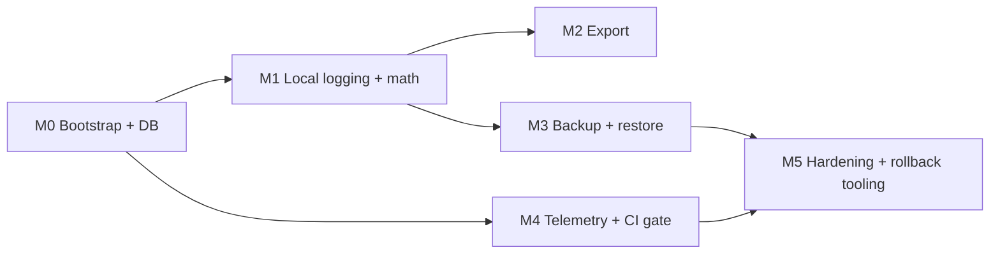

# Delivery plan — v1 (Stage 5)

**Status:** Active — **Stage 5 Step 11 (implementation).** M0 (**bootstrap + client DB**) is **implemented in repo** (2026-04-18): Flutter + Drift client under `[client/](../../client/)`, SQL fixtures under `[tests/client-db/](../../tests/client-db/)`, CI descriptors `[ci/client-build.yml](../../ci/client-build.yml)` + live telemetry client scan in `[ci/telemetry-gate.py](../../ci/telemetry-gate.py)`. Linear **CES-36** / **CES-37** track review/merge; remaining milestones **M1–M5** below. Source for Linear `[Delivery v1` epic (CES-35)](https://linear.app/personal-interests-llc/issue/CES-35/delivery-v1-stage-5-engineering-breakdown) and per-vertical children. **Granular 🟩/🟨/🟥:** [§ Implementation checklist (RYG)](#implementation-checklist-ryg) + [§ Stage 5 exit criteria (tracking)](#stage-5-exit-criteria-tracking).

**Workflow:** `[PRODUCT_DEV_WORKFLOW.md](PRODUCT_DEV_WORKFLOW.md)` (Stage 5 section).  
**Baseline:** `[PRODUCT_BRIEF.md](PRODUCT_BRIEF.md)` (locked v1 scope).  
**Architecture:** `[../specs/ARCHITECTURE.md](../specs/ARCHITECTURE.md)`, [ADR 001](../specs/adr/001-backend-api-boundary.md) (backend boundary), [ADR 002](../specs/adr/002-backup-sync-layer.md) (backup/sync), [ADR 003](../specs/adr/003-mobile-stack.md) (mobile stack), [ADR 004](../specs/adr/004-telemetry-crash-sdk.md) (telemetry/crash SDK).

Stage 5 exit (copied from workflow): **running build with test strategy tied to spec risks (math, backup, export).** Stage 5 is **not** launch — that's Stage 6.

---

## Milestone spine

Ship in dependency order. Each milestone is a coherent Cursor execution; verticals inside a milestone can be parallelized once prerequisites are in place.

- **M0 — Bootstrap + DB:** mobile client shell + client DB schema + migrations. Unblocks everything. **Repo status:** client app + Drift `schema_version` 1 + tests + fixtures landed; see `client/README.md`.
- **M1 — Local logging + math:** fill-up/vehicle UI + consumption math + photo pipeline. Offline app is usable end-to-end without a server.
- **M2 — Export:** streaming ZIP + manifest + CSVs. Lets users get their data out before backup exists.
- **M3 — Backup + restore:** server Postgres + RLS + API + outbox + restore + dead-letter UX. Closes the ADR 002 loop.
- **M4 — Telemetry + CI gate:** `ci/telemetry-gate.`* + client wiring once SDK landed (ADR 004). Can start in parallel with M1 once M0 ships.
- **M5 — Hardening:** migration rollback tooling + end-to-end integration tests + Stage 5 exit verification.

---

## Implementation checklist (RYG)

**Legend:** 🟩 Done · 🟨 In Progress · 🟥 To Do

Rollup mirrors milestones **M0→M5** and verticals **CES-36..CES-47** ([epic CES-35](https://linear.app/personal-interests-llc/issue/CES-35/delivery-v1-stage-5-engineering-breakdown)). Update emoji when Linear/repo state changes.

### M0 — Bootstrap + client DB

- 🟨 **M0 rollup** — client shell + Drift v1 + fixtures + CI; unblocks downstream milestones.
  - 🟩 **CES-36 — Mobile client bootstrap** — `[client/](../../client/)`, `[ci/client-build.yml](../../ci/client-build.yml)`; telemetry gate **check 2** scans `client/lib/**/*.dart` for literal `Telemetry.emit` names (`[ci/telemetry-gate.py](../../ci/telemetry-gate.py)`).
  - 🟩 **CES-37 — Client DB schema + migrations** — `client/lib/db/`, `client/test/db/`, `[tests/client-db/fixtures/](../../tests/client-db/fixtures/)`; indexes + INT64 round-trips per test matrix below.
  - 🟨 **Merge / review closure** — CES-36 + CES-37 on Linear; treat M0 rollup 🟩 when both issues are **Done** on the board, not only when code exists on a branch.

### M1 — Local logging + math

- 🟥 **M1 rollup** — offline logging usable end-to-end without a server.
  - 🟥 **CES-38 — Consumption math + golden tests** — pure module + fixtures; home `tests/math/` (planned) per test matrix.
  - 🟥 **CES-39 — Fill-up + vehicle UI** — core logging UX; depends on CES-37 + CES-38.
  - 🟥 **CES-40 — Photo pipeline** — per `[photo-pipeline.md](../specs/photo-pipeline.md)`; depends on CES-37.

### M2 — Export

- 🟥 **M2 rollup** — export before backup exists.
  - 🟥 **CES-41 — Export ZIP** — streaming assembly + manifest; fixture-driven tests in `tests/export/` (planned).

### M3 — Backup + restore

- 🟥 **M3 rollup** — ADR 002 + `sync-protocol` closed in running code + tests.
  - 🟥 **CES-42 — Server Postgres + RLS migrations** — `[tests/rls/](../../tests/rls/)`, `[ci/rls-regression.yml](../../ci/rls-regression.yml)`.
  - 🟥 **CES-43 — Server API + auth** — contract tests `[tests/contract/](../../tests/contract/)` (managed + self-host).
  - 🟥 **CES-44 — Backup / outbox (client)** — depends on CES-37 + CES-43.
  - 🟥 **CES-45 — Restore + dead-letter UX** — depends on CES-44; integration `tests/backup/` (planned).

### M4 — Telemetry + CI gate

- 🟥 **M4 rollup** — allow-listed client emits + CI green end-to-end.
  - 🟥 **CES-46 — Telemetry client wiring** — `[telemetry-allowlist.md](../specs/telemetry-allowlist.md)` + ADR 004.
  - 🟨 **`ci/telemetry-gate.*` in repo** — YAML + schema + Python gate + client Dart scan live; **Apple `PrivacyInfo.xcprivacy` drift check** still skipped until that file exists (see non-verticals below).

### M5 — Hardening + rollback tooling

- 🟥 **M5 rollup** — Stage 5 exit verification + rollback story proven.
  - 🟥 **CES-47 — Client schema migration rollback tooling** — `tests/migrations/` (planned); `[TBD-migration-rollback.md](../specs/TBD-migration-rollback.md)` must be **non-stub** before calling M5 rollup 🟩.
  - 🟥 **End-to-end / exit verification** — every bullet 🟩 in [§ Stage 5 exit criteria (tracking)](#stage-5-exit-criteria-tracking) below.

### Non-verticals / scaffolding (Stage 5)

- 🟨 **`ci/telemetry-gate.*`** — YAML + schema + **client Dart scan** live; Apple manifest drift check **to do** until `PrivacyInfo.xcprivacy` exists.
- 🟥 **`TBD-migration-rollback.md`** — stub → normative spec when vertical 12 (CES-47) starts.

---

## Per-vertical backlog (Linear)

Epic: **[CES-35 Delivery v1](https://linear.app/personal-interests-llc/issue/CES-35/delivery-v1-stage-5-engineering-breakdown)**. Every row below is a child of that epic with a literal `Spec:` line and `blockedBy` relations matching this table.

| #   | Linear                                                           | Vertical                                 | Milestone | `Spec:`                                                                           | Depends on     | Effort | Repo status (2026-04-18)                                                       |
| --- | ---------------------------------------------------------------- | ---------------------------------------- | --------- | --------------------------------------------------------------------------------- | -------------- | ------ | ------------------------------------------------------------------------------ |
| 1   | [CES-36](https://linear.app/personal-interests-llc/issue/CES-36) | Mobile client bootstrap                  | M0        | `docs/specs/adr/003-mobile-stack.md`                                              | —              | medium | **In repo** — `client/`, `ci/client-build.yml`, telemetry check 2 active       |
| 2   | [CES-37](https://linear.app/personal-interests-llc/issue/CES-37) | Client DB schema + migrations            | M0        | `docs/specs/data-model.md` + `docs/specs/si-units.md`                             | CES-36         | medium | **In repo** — `client/lib/db/`, `client/test/db/`, `tests/client-db/fixtures/` |
| 3   | [CES-38](https://linear.app/personal-interests-llc/issue/CES-38) | Consumption math module + golden tests   | M1        | `docs/specs/consumption-math.md`                                                  | CES-37         | low    | —                                                                              |
| 4   | [CES-39](https://linear.app/personal-interests-llc/issue/CES-39) | Fill-up + vehicle UI (core logging)      | M1        | `docs/specs/data-model.md` + `docs/product/PRODUCT_BRIEF.md`                      | CES-37, CES-38 | high   | —                                                                              |
| 5   | [CES-40](https://linear.app/personal-interests-llc/issue/CES-40) | Photo pipeline implementation            | M1        | `docs/specs/photo-pipeline.md`                                                    | CES-37         | medium | —                                                                              |
| 6   | [CES-41](https://linear.app/personal-interests-llc/issue/CES-41) | Export ZIP                               | M2        | `docs/specs/export-v1.md`                                                         | CES-37         | medium | —                                                                              |
| 7   | [CES-42](https://linear.app/personal-interests-llc/issue/CES-42) | Server Postgres + RLS migrations         | M3        | `docs/specs/data-model.md` + `docs/specs/adr/001-backend-api-boundary.md`         | —              | medium | —                                                                              |
| 8   | [CES-43](https://linear.app/personal-interests-llc/issue/CES-43) | Server API + auth                        | M3        | `docs/specs/adr/001-backend-api-boundary.md` + `docs/specs/sync-protocol.md`      | CES-42         | high   | —                                                                              |
| 9   | [CES-44](https://linear.app/personal-interests-llc/issue/CES-44) | Backup / outbox (client)                 | M3        | `docs/specs/adr/002-backup-sync-layer.md` + `docs/specs/sync-protocol.md`         | CES-37, CES-43 | high   | —                                                                              |
| 10  | [CES-45](https://linear.app/personal-interests-llc/issue/CES-45) | Restore + dead-letter UX                 | M3        | `docs/specs/sync-protocol.md`                                                     | CES-44         | medium | —                                                                              |
| 11  | [CES-46](https://linear.app/personal-interests-llc/issue/CES-46) | Telemetry client wiring                  | M4        | `docs/specs/telemetry-allowlist.md` + `docs/specs/adr/004-telemetry-crash-sdk.md` | CES-36         | medium | —                                                                              |
| 12  | [CES-47](https://linear.app/personal-interests-llc/issue/CES-47) | Client schema migration rollback tooling | M5        | `docs/specs/TBD-migration-rollback.md`                                            | CES-37         | medium | —                                                                              |

**Non-verticals inside Stage 5** (scaffolded separately, not app code):

- `ci/telemetry-gate.`* — YAML + schema + **client Dart scan** (literal `Telemetry.emit` names) live; Apple manifest drift check still skips until `PrivacyInfo.xcprivacy` exists.
- `docs/specs/TBD-migration-rollback.md` — stub lands in Stage 5 Phase 1; vertical 12 turns it into a real spec when started.

---

## Test strategy matrix (tie tests to spec risks)

| Risk area               | Primary spec                                                                                                                  | Test layer                                        | Home                                                                                                                           |
| ----------------------- | ----------------------------------------------------------------------------------------------------------------------------- | ------------------------------------------------- | ------------------------------------------------------------------------------------------------------------------------------ |
| Integer math / rounding | `[consumption-math.md](../specs/consumption-math.md)`, `[si-units.md](../specs/si-units.md)`                                  | Pure-function unit tests + 8 golden fixtures      | Client repo, `tests/math/` (planned M1); **client DB INT64 round-trips** in `[client/test/db/](../../client/test/db/)` (M0)    |
| RLS / roles             | `[data-model.md](../specs/data-model.md)`, [ADR 001](../specs/adr/001-backend-api-boundary.md)                                | SQL regression                                    | `[tests/rls/](../../tests/rls/)`, `[tests/roles/](../../tests/roles/)`, `[ci/rls-regression.yml](../../ci/rls-regression.yml)` |
| API contract            | [ADR 001](../specs/adr/001-backend-api-boundary.md), `[sync-protocol.md](../specs/sync-protocol.md)`                          | Contract tests against managed + self-host        | `[tests/contract/](../../tests/contract/)`                                                                                     |
| Backup / restore        | `[sync-protocol.md](../specs/sync-protocol.md)`, [ADR 002](../specs/adr/002-backup-sync-layer.md)                             | Integration (client+server)                       | `tests/backup/` (to land in M3)                                                                                                |
| Export shape            | `[export-v1.md](../specs/export-v1.md)`                                                                                       | Fixture-driven ZIP assembly + manifest assertions | `tests/export/` (to land in M2)                                                                                                |
| Telemetry drift         | `[telemetry-allowlist.md](../specs/telemetry-allowlist.md)` + `[telemetry-events.v1.yaml](../specs/telemetry-events.v1.yaml)` | YAML + client-source scanner in CI                | `[ci/telemetry-gate.py](../../ci/telemetry-gate.py)` + `[ci/telemetry-gate.yml](../../ci/telemetry-gate.yml)`                  |
| Migration rollback      | `[TBD-migration-rollback.md](../specs/TBD-migration-rollback.md)` (stub)                                                      | Down-migration fixtures                           | `tests/migrations/` (to land in M5)                                                                                            |

---

## Stage 5 exit criteria (tracking)

Leading emoji tracks **exit** state (independent of per-vertical RYG above, but should converge at stage close).

- 🟩 Every vertical above has a Linear issue with a `Spec:` line. *(CES-35 epic + CES-36..CES-47.)*
- 🟨 M0 + M1 land: offline app runs, fill-up works end-to-end, golden math tests green. *(**M0 code in repo** — merge/review CES-36/CES-37; M1 pending.)*
- 🟥 M2 lands: ZIP export round-trips for a representative fixture.
- 🟥 M3 lands: backup/restore passes `tests/contract/` + integration fixtures; RLS regression green.
- 🟥 M4 lands: `ci/telemetry-gate.`* green; client emits only allow-listed events.
- 🟥 M5 lands: migration rollback spec real (not stub); rollback tooling proven against fixture.

When every exit bullet above is 🟩, Stage 5 exit is met — flip workflow percentage and open Stage 6.

---

## Non-goals (Stage 5)

- Store submission, privacy manifests filled with real SDK values, or legal copy — all Stage 6 / counsel.
- Live multi-device sync merge rules — v1.x per ADR 002.
- VIN / tire / wheel UX specs beyond data-model columns — brief lists as follow-up, not v1 blocker.

---

## Related

- `[PRODUCT_BRIEF.md](PRODUCT_BRIEF.md)` — locked scope.
- `[launch-copy-v1.md](launch-copy-v1.md)` — Stage 4 copy; feeds Stage 6.
- `[../specs/platform-compliance-v1.md](../specs/platform-compliance-v1.md)` — compliance posture already signed off.

