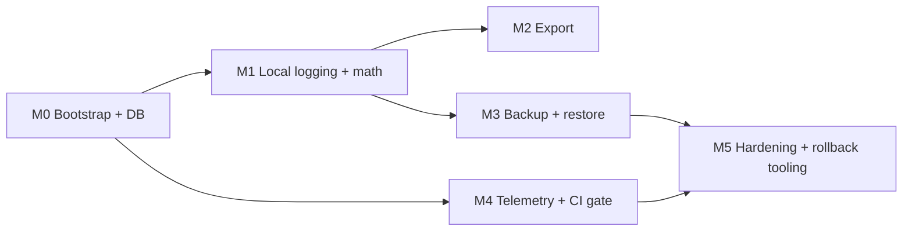

# Delivery plan — v1 (Stage 5)

**Status:** Active — **Stage 5 Step 11 (implementation).** **M0 closed 2026-04-22** — Linear **CES-36** / **CES-37** in **Done**, CTO review passed, `verify-full` green on `main`. **Current execution: M1** — **CES-38 Done in repo** on `main` (consumption module + 20 golden fixtures + `client/test/consumption/` runner). **CES-39 in progress:** phases 1–2 on `main` (repositories, vehicle CRUD/settings); phase 3 Log + History UI on branch `docs/android-first-sequencing` (**merge to `main`** before PWA-lite gate rows). **CES-39 gate prerequisites Done in repo** — [§ M1 prerequisite — UX gap closure](#m1-prerequisite--ux-gap-closure-blocks-ces-39) (**CES-53**–**CES-56**). **Linear hygiene:** mark gate issues **Done** + drop stale **blocks CES-39** edges. **Still open under M1 (not CES-39 alone):** **CES-40** photo, Metrics/Maint tab UI, settings units/currency (**CES-57**). Parent **CES-35**. M0 follow-ups: **CES-48**, **CES-49** (blocks CES-42), **CES-50** (blocks CES-47). M1 follow-ups: **CES-51**, **CES-52**. Source: Linear epic **[CES-35](https://linear.app/personal-interests-llc/issue/CES-35/delivery-v1-stage-5-engineering-breakdown)**. **Granular 🟩/🟨/🟥:** [§ Implementation checklist (RYG)](#implementation-checklist-ryg) + [§ Stage 5 exit criteria (tracking)](#stage-5-exit-criteria-tracking).

**Workflow:** `[PRODUCT_DEV_WORKFLOW.md](PRODUCT_DEV_WORKFLOW.md)` (Stage 5 section).  
**Baseline:** `[PRODUCT_BRIEF.md](PRODUCT_BRIEF.md)` (locked v1 scope).  
**Architecture:** `[../specs/ARCHITECTURE.md](../specs/ARCHITECTURE.md)`, [ADR 001](../specs/adr/001-backend-api-boundary.md) (backend boundary), [ADR 002](../specs/adr/002-backup-sync-layer.md) (backup/sync), [ADR 003](../specs/adr/003-mobile-stack.md) (mobile stack), [ADR 004](../specs/adr/004-telemetry-crash-sdk.md) (telemetry/crash SDK), [ADR 005](../specs/adr/005-distribution-channels.md) (Stage 1 distribution).

Stage 5 exit (copied from workflow): **running build with test strategy tied to spec risks (math, backup, export).** Stage 5 is **not** launch — that's Stage 6.

---

## Milestone spine

Ship in dependency order. Each milestone is a coherent Cursor execution; verticals inside a milestone can be parallelized once prerequisites are in place.

- **M0 — Bootstrap + DB:** mobile client shell + client DB schema + migrations. Unblocks everything. **Repo status:** client app + Drift `schema_version` **2** (post-CES-53 maintenance migration) + tests + fixtures landed; see `client/README.md`.
- **M1 — Local logging + math:** fill-up/vehicle UI + consumption math + photo pipeline. Offline app is usable end-to-end without a server.
- **M2 — Export:** streaming ZIP + manifest + CSVs. Lets users get their data out before backup exists.
- **M3 — Backup + restore:** server Postgres + RLS + API + outbox + restore + dead-letter UX. Closes the ADR 002 loop.
- **M4 — Telemetry + CI gate:** `ci/telemetry-gate.`* + client wiring once SDK landed (ADR 004). Can start in parallel with M1 once M0 ships.
- **M5 — Hardening:** migration rollback tooling + end-to-end integration tests + Stage 5 exit verification.

---

## M1 prerequisite — UX gap closure (blocks CES-39)

Before **CES-39** (fill-up + vehicle UI) and any M1 work that depends on aligned contracts and shell chrome (same navigation and vehicle context as History / Metrics / Maint), close the gaps tracked in **[`ux/UX_IMPLEMENTATION_GAPS.md`](ux/UX_IMPLEMENTATION_GAPS.md)**.

**Prerequisite checklist:** tracker **Status** = **Done** for every **Critical gaps** row; **Linear** workflow + **blocks CES-39** relations must match (CES-53: repo already Done — align Linear).

1. **Maintenance UX ↔ data model** — [CES-53](https://linear.app/personal-interests-llc/issue/CES-53): **Done in repo** (2026-04-22) — `DATA_CONTRACTS.md`, `data-model.md`, Drift `maintenance_events`, migration `0002_add_maintenance_events_category_shop`. **Linear:** mark Done + drop blocks-CES-39 if still attached.
2. **Date-only maintenance** — [CES-54](https://linear.app/personal-interests-llc/issue/CES-54): **Done in repo** (2026-04-24) — `DATA_CONTRACTS.md` § *Performed time (maintenance)*, `data-model.md` § `maintenance_events` + Conventions. **Linear:** mark Done + drop blocks-CES-39 if still attached.
3. **Visual system bootstrap** — [CES-55](https://linear.app/personal-interests-llc/issue/CES-55): **Done in repo** (2026-04-25) — `client/lib/app/theme/` with `CestovniColors` (light + dark), `CestovniMetrics`, `CestovniTypography` (`labelMono` token), `CestovniTheme.dark()` / `light()` (`themeMode: dark` default), `LedgerCard` / `LedgerTile` / `HairlineDivider`; smoke test in `client/test/app/theme/`. **Linear:** mark Done + drop blocks-CES-39 if still attached.
4. **Shell + active vehicle** — [CES-56](https://linear.app/personal-interests-llc/issue/CES-56): **Done in repo** (2026-04-25) — `client/lib/app/shell.dart` four target tabs (Log / History / Metrics / Maint) + shared header; `ActiveVehicle` in `client/lib/app/active_vehicle.dart`; Settings + Debug as pushed routes. **CES-39 follow-on:** Log + History implemented (phase 3, branch pending merge); Metrics + Maint still stubs; `settings.default_vehicle_id` + units/currency prefs deferred (**CES-57**). **Linear:** mark Done + drop blocks-CES-39 if still attached.

Linear: **Critical gaps** all **Done in repo**; align Linear status + drop stale **blocks CES-39** edges. **CES-39 implementation is underway** (phases 1–3; see M1 checklist).

**Out of scope for this gate (separate M1 verticals):** photo pipeline (**CES-40**); Metrics/Maint tab UI beyond shell stubs.

---

## Implementation checklist (RYG)

**Legend:** 🟩 Done · 🟨 In Progress · 🟥 To Do

Rollup mirrors milestones **M0→M5** and verticals **CES-36..CES-47** ([epic CES-35](https://linear.app/personal-interests-llc/issue/CES-35/delivery-v1-stage-5-engineering-breakdown)). Update emoji when Linear/repo state changes.

### M0 — Bootstrap + client DB

- 🟩 **M0 rollup (closed 2026-04-22)** — client shell + Drift v1 + fixtures + CI; downstream milestones unblocked.
  - 🟩 **CES-36 — Mobile client bootstrap** — `[client/](../../client/)`, `[ci/client-build.yml](../../ci/client-build.yml)`; telemetry gate **check 2** scans `client/lib/**/*.dart` for literal `Telemetry.emit` names (`[ci/telemetry-gate.py](../../ci/telemetry-gate.py)`).
  - 🟩 **CES-37 — Client DB schema + migrations** — `client/lib/db/`, `client/test/db/`, `[tests/client-db/fixtures/](../../tests/client-db/fixtures/)`; indexes + INT64 round-trips per test matrix below.
  - 🟩 **Merge / review closure (2026-04-22)** — code on `main` since 2026-04-18; CTO audit passed; `verify-full` green; both Linear issues in **Done**. *(Weekly native iOS CI paused 2026-05-17 — see M-dist.)*
  - 🟨 **M0 follow-ups (tracked, non-blocking):**
    - **CES-48** — tighten `client/test/db/indexes_test.dart` to strict-equality set + note `v*_v*_noop.sql` replay semantics in `tests/client-db/README.md`. *Blocks CES-47.*
    - **CES-49** — enforce `settings.id = user_id` at DB level on client + server (adds first post-`0001_init` migration step). *Blocks CES-42.*
    - **CES-50** — remove `_keepMigratorVisible` scaffold from `client/lib/app/pages/debug_page.dart` when CES-47 lands rollback UI (or before, if CES-47 defers). *Blocks CES-47.*

### M1 — Local logging + math

- 🟨 **M1 rollup** — offline logging usable end-to-end without a server. *(Core fill-up path nearly there; Metrics/Maint/photo/settings prefs still open.)*
  - 🟩 **CES-38 — Consumption math + golden tests** — **Done in repo on `main`** (2026-05): `client/lib/consumption/`, auto-discovery runner over 20 `tests/math/fixtures/`, module-purity test, validation wired in Log/History save paths. Follow-ups: **CES-51** / **CES-52** (non-blocking).
  - 🟨 **CES-39 — Fill-up + vehicle UI** — **current M1 priority**; blocks PWA-lite ([`pwa-lite-gate.md`](../specs/pwa-lite-gate.md)). **On `main`:** repos (phase 1), vehicle CRUD + settings list (phase 2). **On branch (merge pending):** Log form + draft lifecycle, History list/detail/edit/delete (phase 3), 11 widget tests. **Still out of CES-39 scope / later:** Metrics + Maint tabs, photo (**CES-40**), settings units/currency (**CES-57**), History MAINT chip (needs maintenance repo), flip-card History mode (deferred per `DELIVERY_ACCEPTANCE.md`).
  - 🟥 **CES-40 — Photo pipeline** — per `[photo-pipeline.md](../specs/photo-pipeline.md)`; depends on CES-37.
  - 🟩 **M1 UX gap closure (blocks CES-39):** 🟩 **[CES-53](https://linear.app/personal-interests-llc/issue/CES-53)** maintenance contract — **repo Done** · 🟩 **[CES-54](https://linear.app/personal-interests-llc/issue/CES-54)** date-only vs `TIMESTAMPTZ` — **repo Done** (2026-04-24) · 🟩 **[CES-55](https://linear.app/personal-interests-llc/issue/CES-55)** visual bootstrap — **repo Done** (2026-04-25) · 🟩 **[CES-56](https://linear.app/personal-interests-llc/issue/CES-56)** shell + active vehicle — **repo Done** (2026-04-25) — parent epic **[CES-35](https://linear.app/personal-interests-llc/issue/CES-35)**.

### M2 — Export

- 🟥 **M2 rollup** — export before backup exists.
  - 🟥 **CES-41 — Export ZIP** — streaming assembly + manifest; fixture-driven tests in `tests/export/` (planned).

### M3 — Backup + restore

- 🟥 **M3 rollup** — ADR 002 + `sync-protocol` closed in running code + tests.
  - 🟥 **CES-42 — Server Postgres + RLS migrations** — `[tests/rls/](../../tests/rls/)`, `[ci/rls-regression.yml](../../ci/rls-regression.yml)`.
  - 🟥 **CES-43 — Server API + auth** — contract tests `[tests/contract/](../../tests/contract/)` (managed + self-host).
  - 🟥 **CES-44 — Backup / outbox (client)** — depends on CES-37 + CES-43.
  - 🟥 **CES-45 — Restore + dead-letter UX** — depends on CES-44; integration `tests/backup/` (planned).

### M4 — Telemetry + CI gate

- 🟥 **M4 rollup** — allow-listed client emits + CI green end-to-end.
  - 🟥 **CES-46 — Telemetry client wiring** — `[telemetry-allowlist.md](../specs/telemetry-allowlist.md)` + ADR 004.
  - 🟨 **`ci/telemetry-gate.*` in repo** — YAML + schema + Python gate + client Dart scan live; **Apple `PrivacyInfo.xcprivacy` drift check** still skipped until that file exists (see non-verticals below).

### M-dist — Distribution (parallel, non-blocking)

Runs **alongside M1–M5** per [ADR 005](../specs/adr/005-distribution-channels.md). Does not gate feature milestones. **Sequencing (2026-05-21, Option B):** Android path first (CES-39 → minimal M3 client/server → E2E proof); iPhone PWA-lite **blocked** until [PWA-lite gate](../specs/pwa-lite-gate.md) passes.

**M1 priority:** [CES-39](https://linear.app/personal-interests-llc/issue/CES-39) is the active M1 execution focus; it **blocks** PWA-lite.

#### PWA-lite gate

Do not start PWA-lite iPhone work until every item in [`pwa-lite-gate.md`](../specs/pwa-lite-gate.md) is checked on `main`. Execution prompt [`prompts/pwa-lite-phase1-2.md`](prompts/pwa-lite-phase1-2.md) is **PAUSED**.

- 🟨 **M-dist rollup** — Android-first; PWA-lite blocked on Android E2E gate.
  - 🟩 **ADR 005 + brief + Glitchtip addendum** — accepted 2026-05-17.
  - 🟩 **Weekly native iOS CI paused** — [`ci/paused/verify-ios-weekly.yml`](../../ci/paused/verify-ios-weekly.yml) (no GitHub triggers until App Store re-scoped).
  - 🟩 **PWA offline spike** — NO-GO; archived [`../archive/spike-pwa-offline/`](../archive/spike-pwa-offline/).
  - 🟨 **CES-39 — Android Log + History** — phase 3 landed on branch `docs/android-first-sequencing`; **merge to `main`** then check gate rows in [`pwa-lite-gate.md`](../specs/pwa-lite-gate.md). Defines contract PWA-lite mirrors ([`DATA_CONTRACTS.md`](ux/DATA_CONTRACTS.md)).
  - 🟥 **Minimal M3 client slice** — outbox enqueue on fill-up save + flush ([CES-44](https://linear.app/personal-interests-llc/issue/CES-44)); pulled forward for gate only.
  - 🟥 **Minimal M3 server slice** — `POST /api/v1/mutations` + `GET /api/v1/changes` for `fill_ups` ([CES-43](https://linear.app/personal-interests-llc/issue/CES-43)); dev/staging OK.
  - 🟥 **Android E2E proof** — offline fill-up → sync → row on server; documented per gate doc.
  - 🟥 **PWA-lite (iPhone)** — **blocked** on gate; spec [`pwa-lite-v1.md`](../specs/pwa-lite-v1.md).
  - 🟥 **Android APK tag release + install doc** — [`install-android.md`](install-android.md) stub; CI release job TBD.
  - 🟥 **iOS PWA-lite deploy + install doc** — [`install-ios.md`](install-ios.md); after gate + implementation.
  - 🟥 **CI web-lite deploy job** — after PWA-lite ships (post-gate).
  - 🟥 **Compliance / launch-copy** — direct-install + PWA disclosures (Stage 6 overlap OK for counsel).

### M5 — Hardening + rollback tooling

- 🟥 **M5 rollup** — Stage 5 exit verification + rollback story proven.
  - 🟥 **CES-47 — Client schema migration rollback tooling** — `tests/migrations/` (planned); `[TBD-migration-rollback.md](../specs/TBD-migration-rollback.md)` must be **non-stub** before calling M5 rollup 🟩.
  - 🟥 **End-to-end / exit verification** — every bullet 🟩 in [§ Stage 5 exit criteria (tracking)](#stage-5-exit-criteria-tracking) below.

### Non-verticals / scaffolding (Stage 5)

- 🟨 **`ci/telemetry-gate.*`** — YAML + schema + **client Dart scan** live; Apple manifest drift check **to do** until `PrivacyInfo.xcprivacy` exists.
- 🟥 **`TBD-migration-rollback.md`** — stub → normative spec when vertical 12 (CES-47) starts.

---

## Per-vertical backlog (Linear)

Epic: **[CES-35 Delivery v1](https://linear.app/personal-interests-llc/issue/CES-35/delivery-v1-stage-5-engineering-breakdown)**. Every row below is a child of that epic with a literal `Spec:` line and `blockedBy` relations matching this table.

| #   | Linear                                                           | Vertical                                 | Milestone | `Spec:`                                                                                                                                                                             | Depends on     | Effort | Repo status (2026-04-22, post-CES-53)                                                                   |
| --- | ---------------------------------------------------------------- | ---------------------------------------- | --------- | ----------------------------------------------------------------------------------------------------------------------------------------------------------------------------------- | -------------- | ------ | -------------------------------------------------------------------------------------------------------- |
| 1   | [CES-36](https://linear.app/personal-interests-llc/issue/CES-36) | Mobile client bootstrap                  | M0        | `docs/specs/adr/003-mobile-stack.md`                                                                                                                                                | —              | medium | **In repo** — `client/`, `ci/client-build.yml`, telemetry check 2 active                                 |
| 2   | [CES-37](https://linear.app/personal-interests-llc/issue/CES-37) | Client DB schema + migrations            | M0        | `docs/specs/data-model.md` + `docs/specs/si-units.md`                                                                                                                               | CES-36         | medium | **In repo** — `client/lib/db/`, `client/test/db/`, `tests/client-db/fixtures/`                           |
| 3   | [CES-38](https://linear.app/personal-interests-llc/issue/CES-38) | Consumption math module + golden tests   | M1        | `docs/specs/consumption-math.md`                                                                                                                                                    | CES-37         | low    | **Done in repo on `main`** — `client/lib/consumption/`, `client/test/consumption/` (20 fixtures), phase 2 purity + CI coverage (2026-05) |
| 4   | [CES-39](https://linear.app/personal-interests-llc/issue/CES-39) | Fill-up + vehicle UI (core logging)      | M1        | `docs/specs/data-model.md` + `docs/product/PRODUCT_BRIEF.md` + `docs/product/ux/cestovni-views.md` + `docs/product/ux/DATA_CONTRACTS.md` + `docs/product/ux/DELIVERY_ACCEPTANCE.md` + `docs/product/ux/UX_IMPLEMENTATION_GAPS.md` | CES-37, CES-38 (CES-53–CES-56 **Done** in repo) | high   | **In progress** — `main`: repos + vehicle CRUD (phases 1–2). Branch: Log + History UI (phase 3, merge pending). Out: Metrics/Maint tabs, photo, settings prefs |
| 5   | [CES-40](https://linear.app/personal-interests-llc/issue/CES-40) | Photo pipeline implementation            | M1        | `docs/specs/photo-pipeline.md`                                                                                                                                                      | CES-37         | medium | —                                                                                                        |
| 6   | [CES-41](https://linear.app/personal-interests-llc/issue/CES-41) | Export ZIP                               | M2        | `docs/specs/export-v1.md`                                                                                                                                                           | CES-37         | medium | —                                                                                                        |
| 7   | [CES-42](https://linear.app/personal-interests-llc/issue/CES-42) | Server Postgres + RLS migrations         | M3        | `docs/specs/data-model.md` + `docs/specs/adr/001-backend-api-boundary.md`                                                                                                           | —              | medium | —                                                                                                        |
| 8   | [CES-43](https://linear.app/personal-interests-llc/issue/CES-43) | Server API + auth                        | M3        | `docs/specs/adr/001-backend-api-boundary.md` + `docs/specs/sync-protocol.md`                                                                                                        | CES-42         | high   | —                                                                                                        |
| 9   | [CES-44](https://linear.app/personal-interests-llc/issue/CES-44) | Backup / outbox (client)                 | M3        | `docs/specs/adr/002-backup-sync-layer.md` + `docs/specs/sync-protocol.md`                                                                                                           | CES-37, CES-43 | high   | —                                                                                                        |
| 10  | [CES-45](https://linear.app/personal-interests-llc/issue/CES-45) | Restore + dead-letter UX                 | M3        | `docs/specs/sync-protocol.md`                                                                                                                                                       | CES-44         | medium | —                                                                                                        |
| 11  | [CES-46](https://linear.app/personal-interests-llc/issue/CES-46) | Telemetry client wiring                  | M4        | `docs/specs/telemetry-allowlist.md` + `docs/specs/adr/004-telemetry-crash-sdk.md`                                                                                                   | CES-36         | medium | —                                                                                                        |
| 12  | [CES-47](https://linear.app/personal-interests-llc/issue/CES-47) | Client schema migration rollback tooling | M5        | `docs/specs/TBD-migration-rollback.md`                                                                                                                                              | CES-37         | medium | —                                                                                                        |

**Non-verticals inside Stage 5** (scaffolded separately, not app code):

- `ci/telemetry-gate.`* — YAML + schema + **client Dart scan** (literal `Telemetry.emit` names) live; Apple manifest drift check still skips until `PrivacyInfo.xcprivacy` exists.
- `docs/specs/TBD-migration-rollback.md` — stub lands in Stage 5 Phase 1; vertical 12 turns it into a real spec when started.

---

## Test strategy matrix (tie tests to spec risks)

| Risk area               | Primary spec                                                                                                                  | Test layer                                        | Home                                                                                                                                                                   |
| ----------------------- | ----------------------------------------------------------------------------------------------------------------------------- | ------------------------------------------------- | ---------------------------------------------------------------------------------------------------------------------------------------------------------------------- |
| Integer math / rounding | `[consumption-math.md](../specs/consumption-math.md)`, `[si-units.md](../specs/si-units.md)`                                  | Pure-function unit tests + 20 golden fixtures     | `tests/math/` + `client/test/consumption/` (**Done on `main`**); **client DB INT64 round-trips** in `[client/test/db/](../../client/test/db/)` (M0) |
| RLS / roles             | `[data-model.md](../specs/data-model.md)`, [ADR 001](../specs/adr/001-backend-api-boundary.md)                                | SQL regression                                    | `[tests/rls/](../../tests/rls/)`, `[tests/roles/](../../tests/roles/)`, `[ci/rls-regression.yml](../../ci/rls-regression.yml)`                                         |
| API contract            | [ADR 001](../specs/adr/001-backend-api-boundary.md), `[sync-protocol.md](../specs/sync-protocol.md)`                          | Contract tests against managed + self-host        | `[tests/contract/](../../tests/contract/)`                                                                                                                             |
| Backup / restore        | `[sync-protocol.md](../specs/sync-protocol.md)`, [ADR 002](../specs/adr/002-backup-sync-layer.md)                             | Integration (client+server)                       | `tests/backup/` (to land in M3)                                                                                                                                        |
| Export shape            | `[export-v1.md](../specs/export-v1.md)`                                                                                       | Fixture-driven ZIP assembly + manifest assertions | `tests/export/` (to land in M2)                                                                                                                                        |
| Telemetry drift         | `[telemetry-allowlist.md](../specs/telemetry-allowlist.md)` + `[telemetry-events.v1.yaml](../specs/telemetry-events.v1.yaml)` | YAML + client-source scanner in CI                | `[ci/telemetry-gate.py](../../ci/telemetry-gate.py)` + `[ci/telemetry-gate.yml](../../ci/telemetry-gate.yml)`                                                          |
| Migration rollback      | `[TBD-migration-rollback.md](../specs/TBD-migration-rollback.md)` (stub)                                                      | Down-migration fixtures                           | `tests/migrations/` (to land in M5)                                                                                                                                    |

---

## Stage 5 exit criteria (tracking)

Leading emoji tracks **exit** state (independent of per-vertical RYG above, but should converge at stage close).

- 🟩 Every vertical above has a Linear issue with a `Spec:` line. *(CES-35 epic + CES-36..CES-47; M0 follow-ups CES-48/49/50 created 2026-04-22, linked to their downstream verticals via `blocks`.)*
- 🟨 M0 + M1 land: offline app runs, fill-up works end-to-end, golden math tests green. *(**M0 closed 2026-04-22**. **M1 active**: CES-38 **Done in repo**; CES-39 Log/History on branch pending merge; Metrics/Maint/photo still open.)*
- 🟥 M2 lands: ZIP export round-trips for a representative fixture.
- 🟥 M3 lands: backup/restore passes `tests/contract/` + integration fixtures; RLS regression green.
- 🟥 M4 lands: `ci/telemetry-gate.`* green; client emits only allow-listed events.
- 🟥 M5 lands: migration rollback spec real (not stub); rollback tooling proven against fixture.

When every exit bullet above is 🟩, Stage 5 exit is met — flip workflow percentage and open Stage 6.

---

## Non-goals (Stage 5)

- Store submission, privacy manifests filled with real SDK values, or legal copy — all Stage 6 / counsel.
- Live multi-device sync merge rules — v1.x per ADR 002.
- VIN / tire / wheel UX specs beyond data-model columns — brief lists as follow-up, not v1 blocker.

---

## Related

- `[PRODUCT_BRIEF.md](PRODUCT_BRIEF.md)` — locked scope.
- `[launch-copy-v1.md](launch-copy-v1.md)` — Stage 4 copy; feeds Stage 6.
- `[../specs/platform-compliance-v1.md](../specs/platform-compliance-v1.md)` — compliance posture already signed off.

