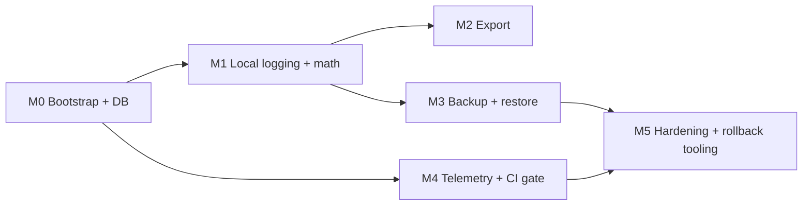

# Delivery plan — v1 (Stage 5)

**Status:** Active — Stage 5 Step 10 (engineering breakdown). Source for Linear `Delivery v1` epic and per-vertical children.

**Workflow:** [`PRODUCT_DEV_WORKFLOW.md`](PRODUCT_DEV_WORKFLOW.md) (Stage 5 section).
**Baseline:** [`PRODUCT_BRIEF.md`](PRODUCT_BRIEF.md) (locked v1 scope).
**Architecture:** [`../specs/ARCHITECTURE.md`](../specs/ARCHITECTURE.md), [ADR 001](../specs/adr/001-backend-api-boundary.md) (backend boundary), [ADR 002](../specs/adr/002-backup-sync-layer.md) (backup/sync), [ADR 003](../specs/adr/003-mobile-stack.md) (mobile stack), [ADR 004](../specs/adr/004-telemetry-crash-sdk.md) (telemetry/crash SDK).

Stage 5 exit (copied from workflow): **running build with test strategy tied to spec risks (math, backup, export).** Stage 5 is **not** launch — that's Stage 6.

---

## Milestone spine

Ship in dependency order. Each milestone is a coherent Cursor execution; verticals inside a milestone can be parallelized once prerequisites are in place.

- **M0 — Bootstrap + DB:** mobile client shell + client DB schema + migrations. Unblocks everything.
- **M1 — Local logging + math:** fill-up/vehicle UI + consumption math + photo pipeline. Offline app is usable end-to-end without a server.
- **M2 — Export:** streaming ZIP + manifest + CSVs. Lets users get their data out before backup exists.
- **M3 — Backup + restore:** server Postgres + RLS + API + outbox + restore + dead-letter UX. Closes the ADR 002 loop.
- **M4 — Telemetry + CI gate:** `ci/telemetry-gate.*` + client wiring once SDK landed (ADR 004). Can start in parallel with M1 once M0 ships.
- **M5 — Hardening:** migration rollback tooling + end-to-end integration tests + Stage 5 exit verification.

---

## Per-vertical backlog (Linear)

Epic: **[CES-35 Delivery v1](https://linear.app/personal-interests-llc/issue/CES-35/delivery-v1-stage-5-engineering-breakdown)**. Every row below is a child of that epic with a literal `Spec:` line and `blockedBy` relations matching this table.

| # | Linear | Vertical | Milestone | `Spec:` | Depends on | Effort |
|---|--------|----------|-----------|---------|------------|--------|
| 1 | [CES-36](https://linear.app/personal-interests-llc/issue/CES-36) | Mobile client bootstrap | M0 | `docs/specs/adr/003-mobile-stack.md` | — | medium |
| 2 | [CES-37](https://linear.app/personal-interests-llc/issue/CES-37) | Client DB schema + migrations | M0 | `docs/specs/data-model.md` + `docs/specs/si-units.md` | CES-36 | medium |
| 3 | [CES-38](https://linear.app/personal-interests-llc/issue/CES-38) | Consumption math module + golden tests | M1 | `docs/specs/consumption-math.md` | CES-37 | low |
| 4 | [CES-39](https://linear.app/personal-interests-llc/issue/CES-39) | Fill-up + vehicle UI (core logging) | M1 | `docs/specs/data-model.md` + `docs/product/PRODUCT_BRIEF.md` | CES-37, CES-38 | high |
| 5 | [CES-40](https://linear.app/personal-interests-llc/issue/CES-40) | Photo pipeline implementation | M1 | `docs/specs/photo-pipeline.md` | CES-37 | medium |
| 6 | [CES-41](https://linear.app/personal-interests-llc/issue/CES-41) | Export ZIP | M2 | `docs/specs/export-v1.md` | CES-37 | medium |
| 7 | [CES-42](https://linear.app/personal-interests-llc/issue/CES-42) | Server Postgres + RLS migrations | M3 | `docs/specs/data-model.md` + `docs/specs/adr/001-backend-api-boundary.md` | — | medium |
| 8 | [CES-43](https://linear.app/personal-interests-llc/issue/CES-43) | Server API + auth | M3 | `docs/specs/adr/001-backend-api-boundary.md` + `docs/specs/sync-protocol.md` | CES-42 | high |
| 9 | [CES-44](https://linear.app/personal-interests-llc/issue/CES-44) | Backup / outbox (client) | M3 | `docs/specs/adr/002-backup-sync-layer.md` + `docs/specs/sync-protocol.md` | CES-37, CES-43 | high |
| 10 | [CES-45](https://linear.app/personal-interests-llc/issue/CES-45) | Restore + dead-letter UX | M3 | `docs/specs/sync-protocol.md` | CES-44 | medium |
| 11 | [CES-46](https://linear.app/personal-interests-llc/issue/CES-46) | Telemetry client wiring | M4 | `docs/specs/telemetry-allowlist.md` + `docs/specs/adr/004-telemetry-crash-sdk.md` | CES-36 | medium |
| 12 | [CES-47](https://linear.app/personal-interests-llc/issue/CES-47) | Client schema migration rollback tooling | M5 | `docs/specs/TBD-migration-rollback.md` | CES-37 | medium |

**Non-verticals inside Stage 5** (scaffolded separately, not app code):

- `ci/telemetry-gate.*` — lands in Stage 5 Phase 3; referenced by vertical 11.
- `docs/specs/TBD-migration-rollback.md` — stub lands in Stage 5 Phase 1; vertical 12 turns it into a real spec when started.

---

## Test strategy matrix (tie tests to spec risks)

| Risk area | Primary spec | Test layer | Home |
|-----------|--------------|------------|------|
| Integer math / rounding | [`consumption-math.md`](../specs/consumption-math.md), [`si-units.md`](../specs/si-units.md) | Pure-function unit tests + 8 golden fixtures | Client repo, `tests/math/` |
| RLS / roles | [`data-model.md`](../specs/data-model.md), [ADR 001](../specs/adr/001-backend-api-boundary.md) | SQL regression | [`tests/rls/`](../../tests/rls/), [`tests/roles/`](../../tests/roles/), [`ci/rls-regression.yml`](../../ci/rls-regression.yml) |
| API contract | [ADR 001](../specs/adr/001-backend-api-boundary.md), [`sync-protocol.md`](../specs/sync-protocol.md) | Contract tests against managed + self-host | [`tests/contract/`](../../tests/contract/) |
| Backup / restore | [`sync-protocol.md`](../specs/sync-protocol.md), [ADR 002](../specs/adr/002-backup-sync-layer.md) | Integration (client+server) | `tests/backup/` (to land in M3) |
| Export shape | [`export-v1.md`](../specs/export-v1.md) | Fixture-driven ZIP assembly + manifest assertions | `tests/export/` (to land in M2) |
| Telemetry drift | [`telemetry-allowlist.md`](../specs/telemetry-allowlist.md) + [`telemetry-events.v1.yaml`](../specs/telemetry-events.v1.yaml) | YAML + client-source scanner in CI | [`ci/telemetry-gate.*`](../../ci/) |
| Migration rollback | [`TBD-migration-rollback.md`](../specs/TBD-migration-rollback.md) (stub) | Down-migration fixtures | `tests/migrations/` (to land in M5) |

---

## Stage 5 exit criteria (tracking)

- [ ] Every vertical above has a Linear issue with a `Spec:` line.
- [ ] M0 + M1 land: offline app runs, fill-up works end-to-end, golden math tests green.
- [ ] M2 lands: ZIP export round-trips for a representative fixture.
- [ ] M3 lands: backup/restore passes `tests/contract/` + integration fixtures; RLS regression green.
- [ ] M4 lands: `ci/telemetry-gate.*` green; client emits only allow-listed events.
- [ ] M5 lands: migration rollback spec real (not stub); rollback tooling proven against fixture.

When every box is ticked, Stage 5 exit is met — flip workflow percentage and open Stage 6.

---

## Non-goals (Stage 5)

- Store submission, privacy manifests filled with real SDK values, or legal copy — all Stage 6 / counsel.
- Live multi-device sync merge rules — v1.x per ADR 002.
- VIN / tire / wheel UX specs beyond data-model columns — brief lists as follow-up, not v1 blocker.

---

## Related

- [`PRODUCT_BRIEF.md`](PRODUCT_BRIEF.md) — locked scope.
- [`launch-copy-v1.md`](launch-copy-v1.md) — Stage 4 copy; feeds Stage 6.
- [`../specs/platform-compliance-v1.md`](../specs/platform-compliance-v1.md) — compliance posture already signed off.
