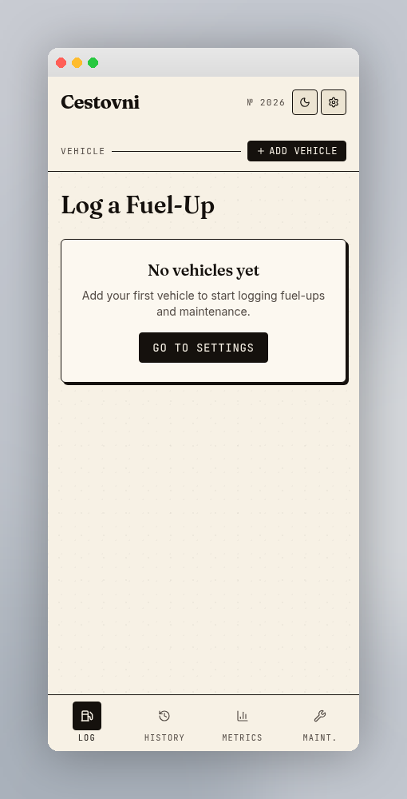

# Add Vehicle CTA Pill

A small, persistent call-to-action that lives in the **app header**, on the right end of the **Vehicle** strip. It is the primary entry point for getting a brand-new user from a blank slate to a usable app state.

---

## Implementation notes (read before interpreting this doc)

This spec is framework-agnostic. Cestovni is a Flutter + Drift app — see [ADR 003](../../specs/adr/003-mobile-stack.md) and [`cestovni-styling.md`](cestovni-styling.md) §14. Translate the designer's web-ish vocabulary below as follows:

- **Routing:** `<Link to="/settings">` → a Flutter shell-tab navigation to the Settings tab (current shell in `client/lib/app/shell.dart`). Whether the tap pushes a page or switches tabs is a [CES-56](https://linear.app/personal-interests-llc/issue/CES-56) decision; treat `/settings` as a **logical destination**, not a URL.
- **Components:** `AppHeader`, `<Select>`, and `EmptyVehiclesPrompt` are **logical names** for Flutter widgets to be introduced in `client/lib/app/` by [CES-39](https://linear.app/personal-interests-llc/issue/CES-39). They are not existing files.
- **Active vehicle contract:** the pill is mutually exclusive with the vehicle selector per [CES-56](https://linear.app/personal-interests-llc/issue/CES-56) — see that issue for persistence of `selectedVehicleId` / `defaultVehicleId`.
- **Tokens over utilities:** any Tailwind-looking string (`font-mono uppercase tracking-wider text-xs`, `h-3 w-3`, `gap-1`, `px-2.5 py-1`, `rounded-md`) maps to semantic tokens in [`cestovni-styling.md`](cestovni-styling.md) §2 (`labelMono`), §3 (`radiusBase = 6dp`, `0.375rem ≈ 6dp`), and the pill recipe in §10. Do not hardcode hex.
- **Theme:** semantic `ink` / `paper` roles invert between light and dark — see [`cestovni-styling.md`](cestovni-styling.md) §5. Never hardcode black or white for foreground.

---

## When it appears

- **Visible** whenever the store contains zero vehicles (`vehicles.length === 0`).
- **Replaced** by a vehicle-picker selector as soon as one or more vehicles exist. The CTA is mutually exclusive with the vehicle picker — never both.
- Renders identically across every route (Log, History, Metrics, Maintenance) because it lives in the shared app-header widget.

## Visual spec

Values below are the designer's reference in CSS units; the right column gives the Flutter/token equivalent. When both disagree, the token wins.

- Shape: a compact **pill** with the same radius as other ledger controls — `0.375rem` ≈ `radiusBase (6dp)` per [`cestovni-styling.md`](cestovni-styling.md) §3.
- Fill: solid **ink** (`ink` token — near-black in light mode, cream-ink in dark mode; see §5).
- Text: **paper** color (`paper` token), all-caps, mono, tracked wider — apply the `labelMono` text style (§2).
- Icon: a **lucide `Plus`** glyph (Flutter: `Icons.add`), `h-3 w-3` ≈ 12 dp, sitting tight against the label with ~4 dp gap.
- Border: `1px solid ink` on all sides — matches the inverted pill family used for active toggle states (see §10 `default` pill inverted).
- Padding: `px-2.5 py-1` ≈ 10 dp horizontal / 4 dp vertical. Sits inline with the **VEHICLE** label and a hairline rule that fills the space between them.

## Behavior

- Tapping the pill navigates to the **Settings** tab. Keep navigation mechanism (tab switch vs sub-page push) consistent with the shell decision in [CES-56](https://linear.app/personal-interests-llc/issue/CES-56).
- On Settings, the user lands directly above the **Vehicles** card where an **Add** button opens the vehicle dialog (name, make/model, year, fuel type, starting odometer, color swatch).
- After the first vehicle is added, the store auto-selects it as both `selectedVehicleId` and `defaultVehicleId` — this is the CES-56 active-vehicle contract. On the next render of the header, the CTA disappears and the vehicle selector takes its slot.

## Empty-state pairing

The CTA in the header is reinforced by the **empty-state card** rendered in the body of every data view (Log, History, Metrics, Maintenance) when no vehicles exist — see [`cestovni-full-views.md`](cestovni-full-views.md) §10 for the visual. That card carries the same destination — a larger `GO TO SETTINGS` button — so users have two redundant paths to the same place. The header pill is the persistent, lightweight reminder; the body card is the louder one-time invitation.

This closes the "No vehicles: guided CTA to create first vehicle" empty-state bullet in [`cestovni-views.md`](cestovni-views.md).

## Accessibility

- The tap target inherits its accessible name from the visible **"Add vehicle"** label — no extra `aria-label` needed.
- In Flutter: wrap the pill in `Semantics(button: true, label: 'Add vehicle')` and mark the icon `excludeSemantics: true` so the `Plus` glyph is not announced separately.
- Inverted ink-on-paper contrast comfortably exceeds WCAG AA in both themes per the tokens in [`cestovni-styling.md`](cestovni-styling.md) §4–§5.
