# Cestovni — Full-Page View Reference

This document captures every screen of the currently built UI **at full content height** (everything you'd see by scrolling). Use this for redesigning or extending any view — every section, card, control, and data block is visible.

> **Files live in [screenshots/light-parchment/full-scroll/](screenshots/light-parchment/full-scroll/)** alongside this document.

---

## Implementation notes (read before interpreting this doc)

This is a **framework-agnostic design reference**. Cestovni is a Flutter + Drift app — see [ADR 003](../../specs/adr/003-mobile-stack.md) and [cestovni-styling.md](cestovni-styling.md) §14. When the designer's language below drifts from our stack, map it as follows:

- **Units:** any `px` / `rem` value is indicative only — use `dp` per [cestovni-styling.md](cestovni-styling.md) §3 (`radiusBase = 6dp`, `0.375rem ≈ 6dp`).
- **Viewport:** the `820 × 1180` capture is a **content-height reference**, not a target device. All screens are one-column and translate to a standard mobile frame (`375–430 dp` wide). No tablet/desktop layout is implied.
- **Theme:** these captures are the **light-parchment** reference. First-load default is **dark** per [cestovni-styling.md](cestovni-styling.md) §5 — pair with [screenshots/dark-midnight/](screenshots/dark-midnight/) for dark parity.
- **Components:** names like "card", "tile", "pill", "hairline" map to the Flutter primitives in [cestovni-styling.md](cestovni-styling.md) §6 (`LedgerCard`, `LedgerTile`, `HairlineDivider`).
- **Routes:** paths like `/`, `/history`, `/metrics`, `/maintenance`, `/settings` are **logical tab names** for the shell nav defined by [CES-56](https://linear.app/personal-interests-llc/issue/CES-56), not literal URL routes.
- **Scope:** this is a visual reference for the screens [CES-39](https://linear.app/personal-interests-llc/issue/CES-39) will build. It does not override contract docs — see [cestovni-views.md](cestovni-views.md), [DATA_CONTRACTS.md](DATA_CONTRACTS.md), and [DELIVERY_ACCEPTANCE.md](DELIVERY_ACCEPTANCE.md) for must-ship behavior.

---

## 1. Log a Fuel-Up — `/` (Log tab)

The default landing screen. Single-column form with auto-calculated previews and a recap card below the submit button.

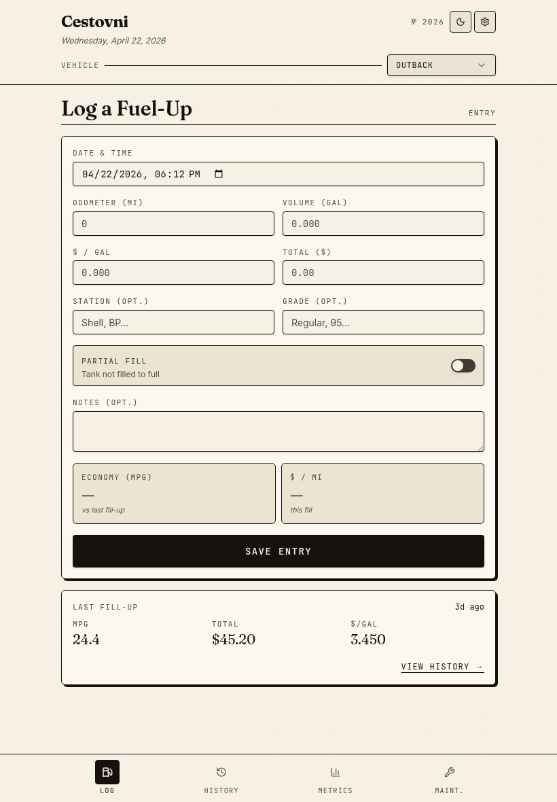

**Sections (top → bottom):**

1. **App header** — wordmark, year mark, theme toggle, settings icon, vehicle selector.
2. **Page title** — "Log a Fuel-Up" + `ENTRY` label-mono on the right.
3. **Entry form card**
  - Date & time (`datetime-local`)
  - Odometer | Volume (two-column)
  - $/gal | Total (two-column, auto-fills total = volume × price)
  - Station | Grade (two-column, both optional)
  - Partial-fill switch row (with helper text "Tank not filled to full")
  - Notes textarea
  - Live preview tiles: **Economy (MPG)** vs last fill-up, and **$/mi** for this fill
  - Solid black **SAVE ENTRY** CTA (full-width, h-12)
4. **Last fill-up recap card** — shows MPG, total, $/gal of the most recent entry with `VIEW HISTORY →` link.
5. **Bottom navigation** — Log (active), History, Metrics, Maint.

---

## 2. History — `/history` (Timeline mode, default)

Scrollable chronological feed grouped by month. Two screenshots required to show full content.

### 2a. Top half

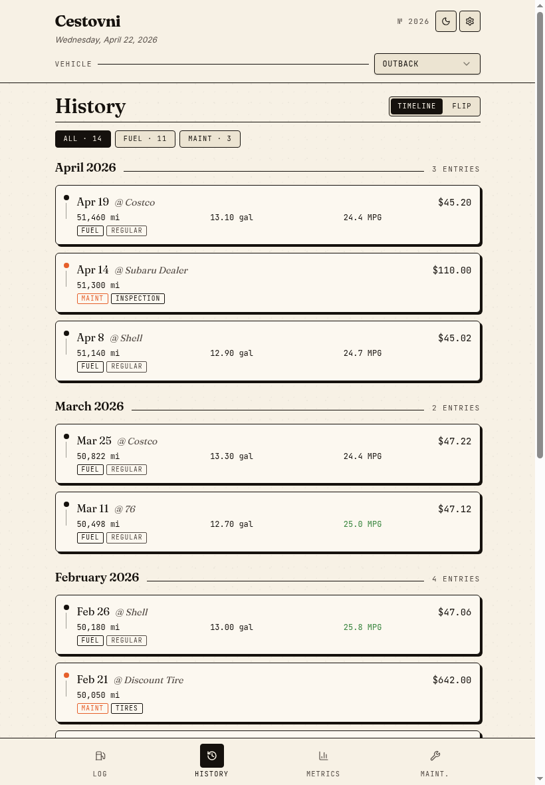

- **Mode toggle** (TIMELINE / FLIP) on the right of the title
- **Filter chips**: ALL · 14 / FUEL · 11 / MAINT · 3 (counts update live)
- **Month section** with hairline rule and entry count on the right (e.g. "April 2026 ──── 3 ENTRIES")
- **Entry pill** structure:
  - Bullet rail on the left (orange dot = maintenance, gray dot = fuel)
  - Date · station/shop · cost (top row)
  - Odometer · volume · MPG (data row, MPG only for fuel)
  - Type pills (FUEL / MAINT) + sub-pill (REGULAR grade or maintenance category like INSPECTION, TIRES, OIL CHANGE)
  - Maintenance entries use a **warn-orange** MAINT pill; fuel entries use a default ink pill
  - Above-average MPG values render in **good-green** (e.g. 25.0 MPG)

### 2b. Bottom half (scrolled)

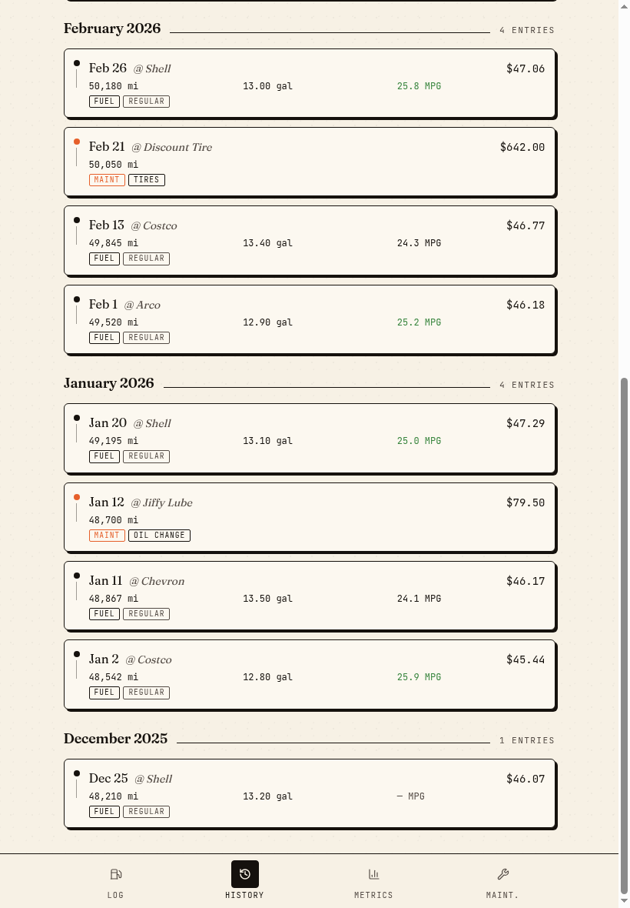

Continues into earlier months. Empty cells (e.g. "— MPG") appear when first-ever entry has no prior odometer to compute from.

---

## 3. History — Flip mode

One entry at a time, paginated with Older / Newer buttons.

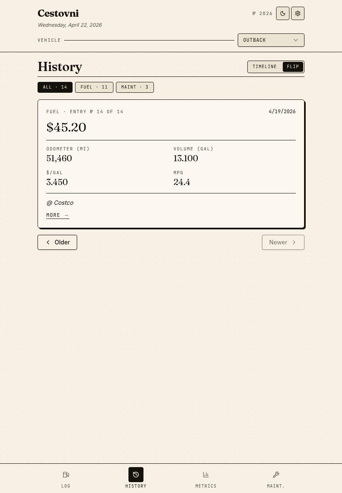

- Card header: type · entry index · date (e.g. `FUEL · ENTRY № 14 OF 14   4/19/2026`)
- Hero figure: the cost (`$45.20`) in large serif numerals
- 2×2 grid of stats: Odometer / Volume / $-per-gal / MPG
- Station/shop on its own row, prefixed with `@`
- `MORE →` ghost link opens the full detail bottom sheet
- Pagination buttons below the card: `← Older` (left) and `Newer →` (right). Disabled state is muted ink.

---

## 4. History — Entry detail (bottom sheet)

Triggered by clicking `MORE →` in Flip mode (and by tapping any timeline pill in Timeline mode).

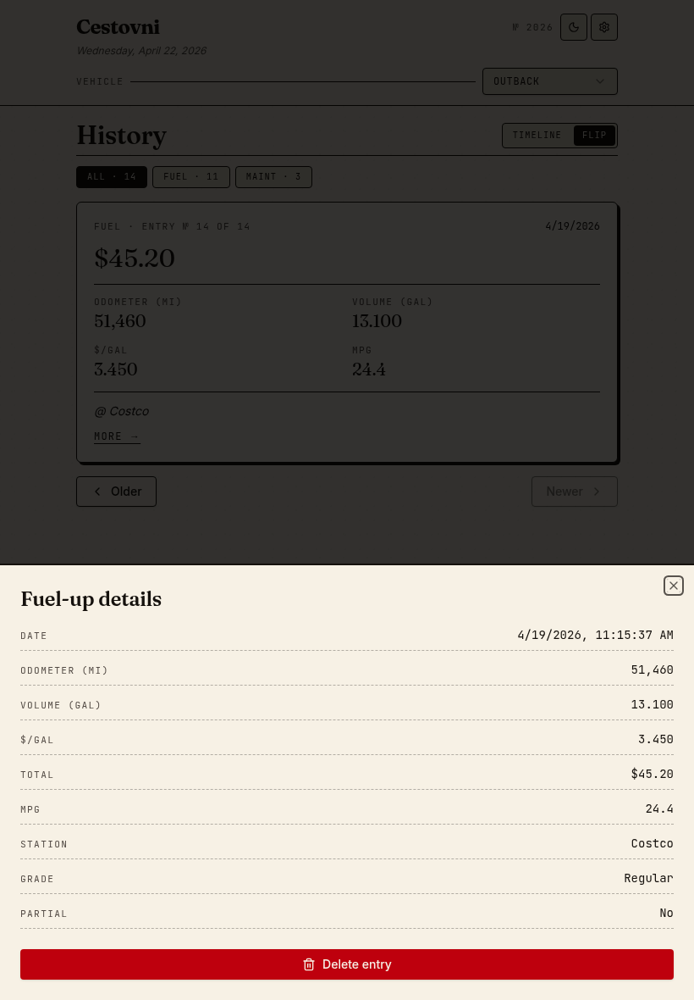

- Slides up from the bottom with a dim scrim over the page
- Title: `Fuel-up details` (or `Maintenance details`) in serif
- Close icon top-right
- **Definition list** of every captured field (Date, Odometer, Volume, $/gal, Total, MPG, Station, Grade, Partial)
- **Delete entry** button at the bottom, full-width, danger-red fill with trash icon

---

## 5. Metrics — `/metrics`

Range toggle + KPI tiles + 5 charts. Two screenshots cover full height.

### 5a. Top half — KPIs and first chart

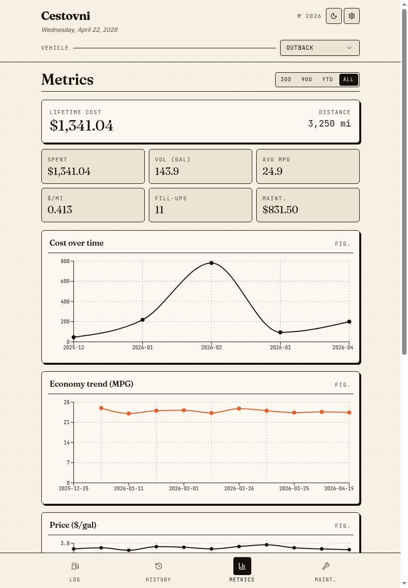

- **Range toggle**: 30D / 90D / YTD / **ALL** (active = ink fill)
- **Lifetime headline card**: large serif `$1,341.04` cost on the left; `3,250 mi` distance on the right with `DISTANCE` label-mono
- **3×2 KPI grid**: SPENT, VOL (GAL), AVG MPG / $/MI, FILL-UPS, MAINT.
  - Each tile: label-mono on top, large serif value below, paper-deep fill, ink border
- **Cost over time** — line chart, ink stroke, dot markers, dashed grid

### 5b. Bottom half — remaining charts

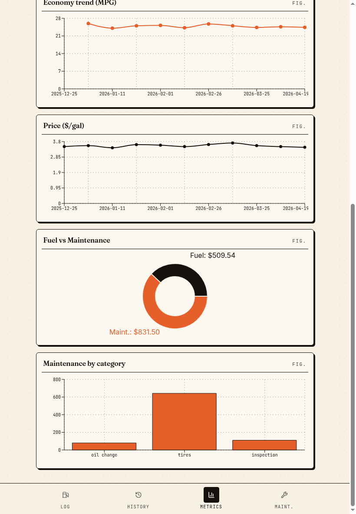

- **Economy trend (MPG)** — line chart in burnt-orange accent
- **Price ($/gal)** — line chart in ink
- **Fuel vs Maintenance** — donut chart (ink slice = fuel, orange slice = maintenance), labels above and below the donut with the dollar totals
- **Maintenance by category** — bar chart in burnt orange (categories on x-axis, dollars on y-axis)

Every chart card has the same wrapper: serif title left, `FIG.` label-mono right, hairline divider, paper background.

---

## 6. Maintenance — `/maintenance`

Single-column form, similar pattern to the Log view but tighter.

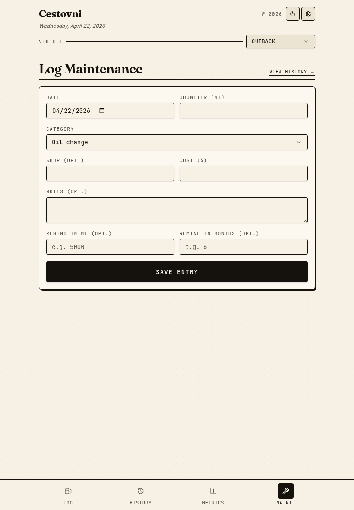

- Title `Log Maintenance` with `VIEW HISTORY →` link in the corner
- Form fields:
  - Date | Odometer (two-column)
  - Category select (Oil change, Tires, Brakes, Inspection, etc.)
  - Shop | Cost (two-column, both optional)
  - Notes textarea
  - **Reminder pair**: Remind in mi (opt.) | Remind in months (opt.) — used to schedule next service hint
  - **SAVE ENTRY** ink CTA (full-width)

> **Contract gap — gated on [CES-53](https://linear.app/personal-interests-llc/issue/CES-53):** the form above marks Shop + Cost as both optional and relies on a `category` field on the event. The current data model ([client/lib/db/tables/maintenance_events.dart](../../../client/lib/db/tables/maintenance_events.dart) / [docs/specs/data-model.md](../../specs/data-model.md)) has `odometer_m`, `cost_cents`, and `currency_code` as **NOT NULL**, no `category` or `shop` columns, and keeps cadence on `maintenance_rules`. Final field optionality and storage shape must be resolved by CES-53 before CES-39 implements this view — see [UX_IMPLEMENTATION_GAPS.md](UX_IMPLEMENTATION_GAPS.md) row 1.

---

## 7. Settings — `/settings`

Stacked card layout, four sections.

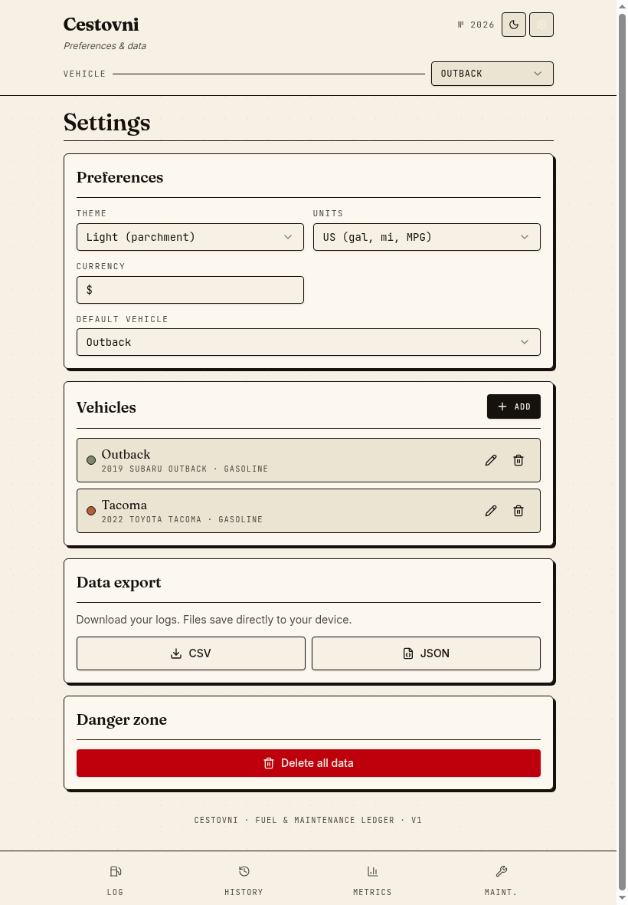

1. **Preferences card**
  - Theme select (Light / Dark)
  - Units select (US / Metric)
  - Currency input
  - Default vehicle select
2. **Vehicles card**
  - `+ ADD` ink button top-right
  - Each vehicle row: color swatch dot · name · model line · pencil edit icon · trash delete icon
3. **Data export card**
  - Helper text: "Download your logs. Files save directly to your device."
  - Two outline buttons side-by-side: `↓ CSV` and `📋 JSON`
4. **Danger zone card**
  - Single full-width destructive button: `🗑 Delete all data`
5. **Footer line**: `CESTOVNI · FUEL & MAINTENANCE LEDGER · V1` (label-mono, centered, muted)

---

## 8. Vehicle dialog (Add / Edit)

Modal triggered by `+ ADD` button on Settings.

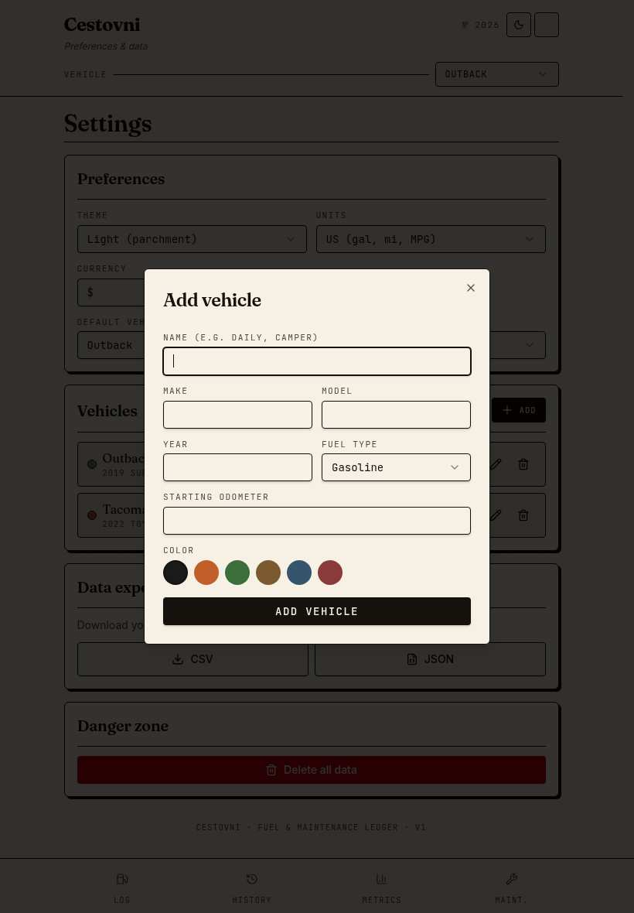

- Centered card with scrim behind
- Title `Add vehicle` / `Edit vehicle` in serif, close × top-right
- Form fields:
  - Name (e.g. Daily, Camper) — primary identifier
  - Make | Model (two-column)
  - Year | Fuel type (two-column, fuel type is a select: Gasoline, Diesel, Electric, Hybrid)
  - Starting odometer
  - **Color swatches** — 6 preset chips in a row (ink, orange, green, olive, blue, burgundy); selected swatch ringed
- Full-width ink **ADD VEHICLE** CTA at the bottom

---

## 9. Confirm dialog (destructive)

Reused pattern for any irreversible action — pictured here for "Erase everything?".

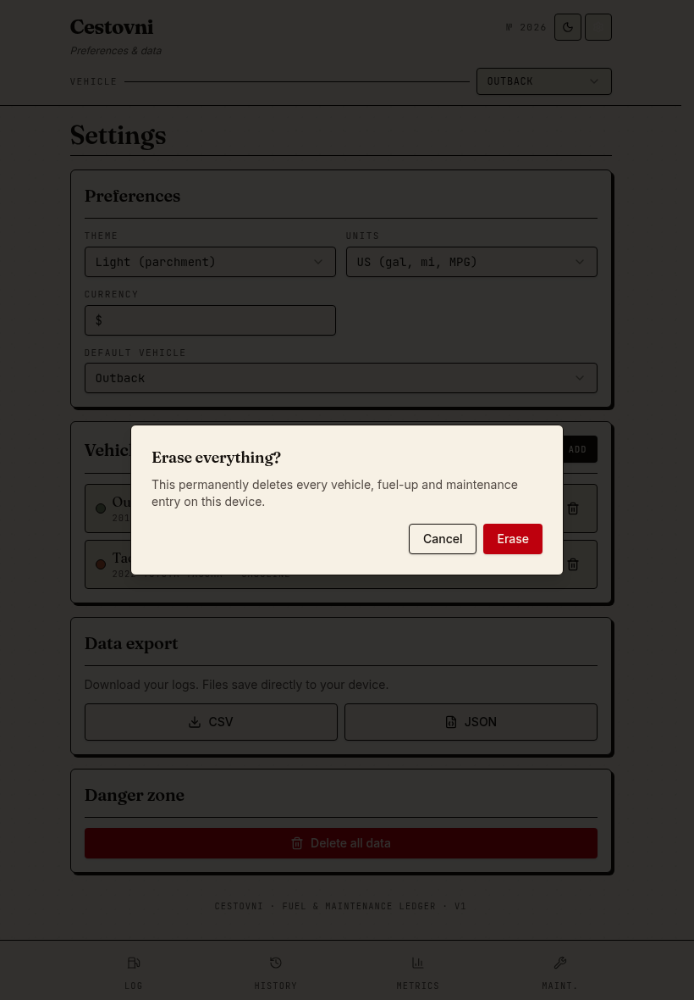

- Compact centered card, no chrome or close button
- Serif title posing the question
- One-line explanation text
- Two buttons right-aligned: `Cancel` (outline) + destructive `Erase` (red fill, no icon — keep verbs short)

---

## 10. Empty state — Add Vehicle CTA

What a brand-new user sees on every data view (Log, History, Metrics, Maintenance) before they create their first vehicle.

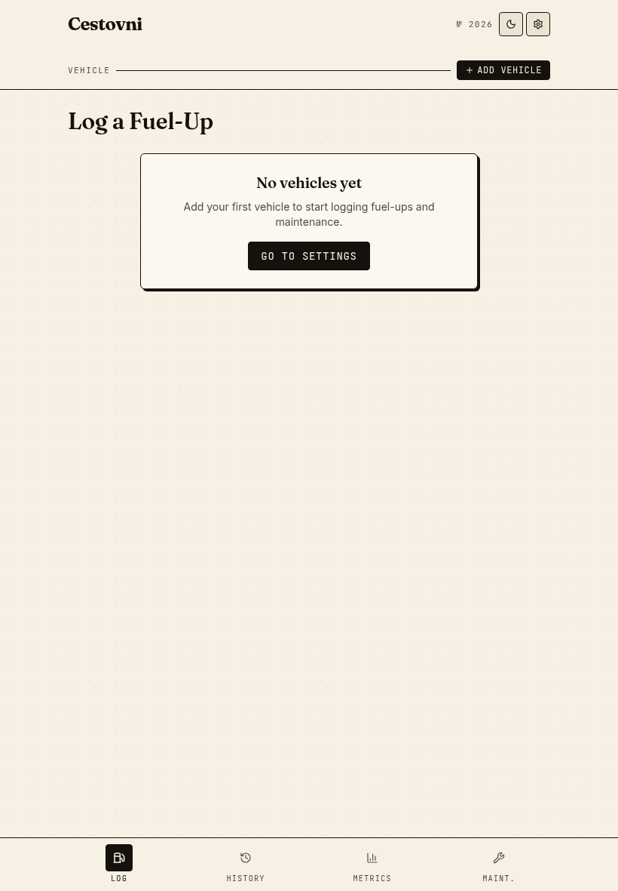

- **Header swap**: vehicle picker is replaced with a `+ ADD VEHICLE` ink pill (compact, mono uppercase)
- **Body**: single centered card titled `No vehicles yet`, helper sentence, and a `GO TO SETTINGS` ink button
- Both header pill and body button route to `/settings`

See [cestovni-add-vehicle-cta.md](cestovni-add-vehicle-cta.md) for the pill spec.

---

## File index

| #   | Screen                 | File                                                         |
| --- | ---------------------- | ------------------------------------------------------------ |
| 1   | Log a Fuel-Up          | [log.png](screenshots/light-parchment/full-scroll/log.png)                       |
| 2a  | History — top          | [history-top.png](screenshots/light-parchment/full-scroll/history-top.png)       |
| 2b  | History — bottom       | [history-bottom.png](screenshots/light-parchment/full-scroll/history-bottom.png) |
| 3   | History Flip mode      | [history-flip.png](screenshots/light-parchment/full-scroll/history-flip.png)     |
| 4   | Entry detail sheet     | [history-detail.png](screenshots/light-parchment/full-scroll/history-detail.png) |
| 5a  | Metrics — top          | [metrics-top.png](screenshots/light-parchment/full-scroll/metrics-top.png)       |
| 5b  | Metrics — bottom       | [metrics-bottom.png](screenshots/light-parchment/full-scroll/metrics-bottom.png) |
| 6   | Maintenance            | [maintenance.png](screenshots/light-parchment/full-scroll/maintenance.png)       |
| 7   | Settings               | [settings.png](screenshots/light-parchment/full-scroll/settings.png)             |
| 8   | Vehicle dialog         | [vehicle-dialog.png](screenshots/light-parchment/full-scroll/vehicle-dialog.png) |
| 9   | Confirm dialog         | [confirm-dialog.png](screenshots/light-parchment/full-scroll/confirm-dialog.png) |
| 10  | Empty state + CTA pill | [empty.png](screenshots/light-parchment/full-scroll/empty.png)                   |

For visual system tokens (colors, typography, spacing) refer to [cestovni-styling.md](cestovni-styling.md). For per-view behavior refer to [cestovni-views.md](cestovni-views.md). For the Add Vehicle CTA pill specification refer to [cestovni-add-vehicle-cta.md](cestovni-add-vehicle-cta.md).
