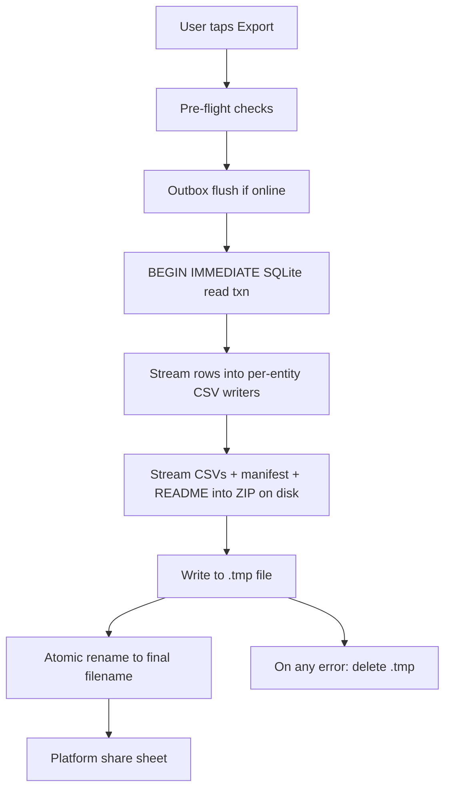

# Spec: Export v1 (ZIP + CSV + manifest)

**Status:** Complete (v1)
**Linear:** CES-28
**Depends on:** [`si-units.md`](si-units.md) (canonical + derived columns), [`data-model.md`](data-model.md) (tables), [`photo-pipeline.md`](photo-pipeline.md) (photos excluded), [`sync-protocol.md`](sync-protocol.md) (outbox flush)

## Purpose

The user's full, portable copy of their structured history: a single ZIP they can share, inspect in a spreadsheet, or import into a different tool. Data portability is a product principle; this spec makes it testable.

## Scope

- **In:** structured data for the signed-in user — `vehicles`, `fill_ups`, `maintenance_rules`, `maintenance_events`, `settings`.
- **Out:** receipt photos (ephemeral, local; see [`photo-pipeline.md`](photo-pipeline.md)), drafts, outbox contents, client logs.

## Output layout

```
cestovni_export_<userkeyhash>_<timestamp>.zip
├── manifest.json
├── README_export.txt
├── vehicles.csv
├── fill_ups.csv
├── maintenance_rules.csv
├── maintenance_events.csv
└── settings.csv
```

- `<userkeyhash>` is the first 8 hex chars of the telemetry user key (not the raw user id; see [`telemetry-allowlist.md`](telemetry-allowlist.md)).
- `<timestamp>` is `YYYYMMDD_HHMMSS` in UTC.

## `manifest.json`

The canonical manifest. Every consumer (a later re-import tool, a test asserting export correctness, or a compliance auditor) reads from here first.

```json
{
  "schema_version": 1,
  "exported_at_utc": "2026-04-17T18:04:22Z",
  "app_version": "0.9.0",
  "app_platform": "ios",
  "timezone": "Europe/Prague",
  "user_key_hash": "9b3a5f01",
  "unit_preferences": {
    "distance": "km",
    "volume":   "L",
    "currency": "EUR"
  },
  "row_counts": {
    "vehicles": 3,
    "fill_ups": 812,
    "maintenance_rules": 12,
    "maintenance_events": 47,
    "settings": 1
  },
  "outbox_pending_count": 0,
  "outbox_pending_hash":  null,
  "photos_in_export": false,
  "max_row_version_seen": 1049
}
```

### Fields

| Field                  | Notes                                                                                            |
| ---------------------- | ------------------------------------------------------------------------------------------------ |
| `schema_version`       | Integer; bump on breaking changes. v1 = `1`.                                                     |
| `exported_at_utc`      | ISO-8601 UTC, second precision.                                                                  |
| `app_version`          | Semver string.                                                                                   |
| `app_platform`         | `ios` or `android`.                                                                              |
| `timezone`             | IANA name from `settings`. CSV `_local` columns use this.                                        |
| `user_key_hash`        | First 8 hex of telemetry user key; enough to disambiguate multiple exports, not enough to trace. |
| `unit_preferences`     | Echo of `settings` at export time; drives CSV derived columns and `README_export.txt`.           |
| `row_counts`           | Per-entity counts of exported rows (after `deleted_at IS NULL` filter).                          |
| `outbox_pending_count` | `0` if the pre-export flush succeeded; `N > 0` if the user is offline or the server rejected some mutations. |
| `outbox_pending_hash`  | SHA-256 over the sorted list of pending `mutation_id`s; `null` when `outbox_pending_count == 0`. |
| `photos_in_export`     | Hard-coded `false`. The assertion lives here so auditors don't have to scan for image files.     |
| `max_row_version_seen` | Highest `row_version` the export reflects; useful for staged re-imports later.                   |

## `README_export.txt`

Plain-text, ASCII, CRLF line endings so Windows spreadsheet users can double-click without mojibake. Contents (template):

```
Cestovni export — created {exported_at_utc}

This archive contains a full copy of the structured data you have
recorded in Cestovni for the account you exported from.

UNIT CONVENTIONS
  Distance canonical: meters (odometer_m)
  Distance display:   {unit_preferences.distance} (odometer_{km|mi})
  Volume canonical:   microliters (volume_uL)
  Volume display:     {unit_preferences.volume} (volume_{L|gal})
  Money canonical:    integer cents (total_price_cents)
  Money display:      {unit_preferences.currency} (total_price_major)

DISPLAY ROUNDING
  Volume:      2 decimals
  Distance:    0 decimals
  L/100km:     1 decimal (not exported as a column; derived in-app)
  Prices:      2 decimals

RECEIPT PHOTOS
  Photos are stored only on your device with a 30-day time-to-live.
  They are NOT included in this export. This is by design.

TIMESTAMPS
  All *_utc columns are ISO-8601 UTC.
  All *_local columns use your preferred timezone ({timezone}).

RE-IMPORT
  The CANONICAL columns (odometer_m, volume_uL, total_price_cents)
  are the source of truth. Derived columns (odometer_km, volume_L,
  total_price_major) are provided for convenience only and may lose
  precision after multiple open/save cycles in a spreadsheet.

OUTBOX STATUS
  outbox_pending_count = {N}
  If > 0, some mutations had not yet been saved to the server at
  the time of export. The data in the CSVs still reflects your
  local state at export time.
```

## CSV schema per entity

Every CSV uses the two-column pattern from [`si-units.md`](si-units.md) (canonical + derived). Common columns first, domain columns next, audit columns last.

### `vehicles.csv`

```csv
id,user_key_hash,name,make,model,year,vin,fuel_type,tank_capacity_uL,tank_capacity_L,archived_at_utc,row_version,updated_at_utc
```

### `fill_ups.csv`

```csv
id,user_key_hash,vehicle_id,filled_at_utc,filled_at_local,odometer_m,odometer_km,odometer_mi,volume_uL,volume_L,volume_gal,total_price_cents,total_price_major,currency_code,is_full,missed_before,odometer_reset,notes,row_version,updated_at_utc
```

### `maintenance_rules.csv`

```csv
id,user_key_hash,vehicle_id,name,cadence_km,cadence_days,enabled,row_version,updated_at_utc
```

### `maintenance_events.csv`

```csv
id,user_key_hash,vehicle_id,rule_id,performed_at_utc,performed_at_local,odometer_m,odometer_km,odometer_mi,cost_cents,cost_major,currency_code,notes,row_version,updated_at_utc
```

### `settings.csv`

One row per user.

```csv
user_key_hash,preferred_distance_unit,preferred_volume_unit,currency_code,timezone,row_version,updated_at_utc
```

### CSV rules

- **Encoding:** UTF-8 **with BOM** (Excel-friendly; non-Excel tools handle BOM fine).
- **Delimiter:** comma.
- **Line endings:** CRLF.
- **Quoting:** RFC 4180 — quote fields containing commas, quotes, or newlines; escape inner quotes by doubling.
- **Nulls:** empty field (not the string `NULL`).
- **Booleans:** `true` / `false`.
- **Soft-deleted rows are excluded.** `deleted_at IS NOT NULL` rows stay inside the app for sync but never leave in export.
- **Derived columns** follow display rounding from [`si-units.md`](si-units.md); canonical columns are integers, always.

## Assembly pipeline



1. **Pre-flight checks:** enough free disk (estimate: `rows × 400 bytes`, floor 5 MB); cleanup old photo TTLs (see [`photo-pipeline.md`](photo-pipeline.md)); if `outbox_pending_count > 0` and offline, surface a warning dialog offering to proceed anyway.
2. **Outbox flush (best-effort):** if online, POST the outbox so the export reflects a backed-up state. Success is **not** required to proceed; failure is reflected in `outbox_pending_count`.
3. **Snapshot semantics:** `BEGIN IMMEDIATE;` on the local SQLite. All CSVs + the manifest derive from the same read-consistent view. The transaction ends as soon as the last CSV is written; the ZIP finalization happens afterwards on disk.
4. **Streaming write:** row-by-row into a ZIP writer backed by a temporary file in the app sandbox. Memory footprint target: ≤ 10 MB for 10 000 fill-ups.
5. **Atomic rename:** the final filename appears only after the ZIP is successfully closed; partial exports are never visible to the user.
6. **Share:** iOS share sheet / Android intent. No in-app upload anywhere; the user controls destination.

## Error handling

| Failure                           | Behavior                                                                              |
| --------------------------------- | ------------------------------------------------------------------------------------- |
| Disk full mid-write               | Delete `.tmp`, show clear error with free-space estimate.                             |
| SQLite locked                     | Retry with backoff once; then fail the export and ask the user to try again.         |
| Outbox flush fails (network)      | Proceed with `outbox_pending_count > 0`; show informative README entry.              |
| CSV row serialization error       | Fail entire export; never emit a partial CSV into the ZIP. Log to crash SDK.         |
| ZIP finalization error            | Delete `.tmp`, fail the user-visible export.                                         |
| App backgrounded during export    | Export continues on a platform background task; on completion, surface a notification.|

Atomicity is a hard contract: either a valid ZIP exists at the final path, or no file exists. There is no state in between.

## Performance target

- **10 000 fill-ups** export on a mid-range Android (3 GB RAM) completes in ≤ 30 s with ≤ 10 MB peak memory.
- **1 000 fill-ups** export on any supported device completes in ≤ 5 s.

Both targets are validated by `tests/export/` fixtures.

## Non-goals (v1)

- **No incremental / diff exports.** Every export is the full structured state.
- **No re-import tool in-app.** The canonical columns + manifest make third-party re-import possible; we do not build UX for it in v1.
- **No photos.** Period.
- **No signed / encrypted ZIP.** User-managed; they can encrypt after export if they want.

## Critical gaps / risks

- **Multiple currencies in `fill_ups`**: the CSV handles this per-row (`currency_code` column), but chart consumers that drop the column will mis-aggregate. Documented in `README_export.txt` rounding section; the UX for trends handles this already (see [`consumption-math.md`](consumption-math.md)).
- **Timezone drift**: `_local` columns reflect the export-time timezone; a user who changes timezone between exports will see different `_local` strings for the same `_utc`. Accept.
- **Row-count drift during export**: we hold a read transaction; writes that the user initiates during a long export are serialized after; this is the standard SQLite reader behavior and is acceptable.

## Test expectations

Tests landing in `tests/export/`:

1. **Golden ZIP** — export a fixed 50-row fixture; assert byte-stable canonical columns, valid `manifest.json`, correct filename format.
2. **Atomicity** — induce a simulated disk-full mid-write; assert no `.tmp` or final file remains.
3. **Photos excluded** — seed 10 photos; run export; assert zero image files in the ZIP and `photos_in_export == false`.
4. **Outbox flush recorded** — run export with 3 pending mutations; assert `outbox_pending_count == 3` and `outbox_pending_hash` is stable for a stable set.
5. **Large dataset** — 10 000 fill-ups; assert performance targets above.
6. **Re-import round-trip** — a separate canonical-columns-only round-trip test (parse CSVs back to a minimal model; assert stored rows match) validates the "canonical is source of truth" promise.

## References

- [`PRODUCT_BRIEF.md`](../product/PRODUCT_BRIEF.md) — export is a locked v1 decision.
- [`si-units.md`](si-units.md) — canonical + derived column contract.
- [`data-model.md`](data-model.md) — exact column lists.
- [`photo-pipeline.md`](photo-pipeline.md) — why photos are absent.
- [`sync-protocol.md`](sync-protocol.md) — outbox flush hook.
