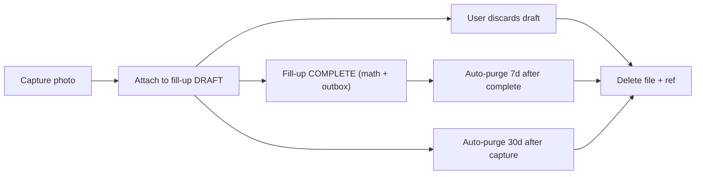

# Spec: Ephemeral photos & deferred fill-up entry

**Status:** Complete (v1)
**Linear:** CES-30
**Depends on:** none — foundational local-only feature; referenced by [`data-model.md`](data-model.md) and [`export-v1.md`](export-v1.md)

## Purpose

Let the user snap a fuel receipt (or other short-lived aid) so they can finish entering the fill-up later — without ever sending the photo to the server or packaging it in an export. Photos are **on-device, ephemeral, and private to the user's device**.

## Non-negotiables (from the product brief)

1. **Never backed up to the server.** No endpoint accepts a photo; no outbox operation carries photo bytes.
2. **Never in the ZIP export.** [`export-v1.md`](export-v1.md) enforces this.
3. **Short TTL, target ~30 days.** Concrete rule below.
4. **No OCR in v1.** Photos are aids to human memory, not input to a parser.

## Lifecycle



- A photo is always attached to exactly one draft; never shared between drafts.
- Completing a draft moves it to a completed `fill_ups` row; the photo remains on the device only until the shorter of:
  - **30 days from `captured_at`**, or
  - **7 days from the fill-up `completed_at`** (whichever comes first).
- Discarding the draft removes the photo immediately.
- If the draft is never completed, the 30-day TTL removes it.

## Capture pipeline

1. **Acquire** image via platform camera API.
2. **Normalize orientation** using EXIF orientation tag (then discard the tag).
3. **Resize** to long-edge **1 600 px** (preserves text legibility on a receipt; keeps files small).
4. **Recompress** as **JPEG quality 80** → target footprint ~150–250 KB.
5. **Strip EXIF** hard-list:
   - **Strip:** GPS (all `GPSInfo`), device serial numbers, owner name, software fingerprints, camera lens serial, Apple/Android maker notes.
   - **Preserve:** `capture_time` (converted to UTC, stored in `photo_refs.captured_at`).
6. **Hash** the resulting bytes with SHA-256.
7. **Write** to `photos/<uuid>.jpg` inside the app sandbox.
8. **Insert** a row in local `photo_refs` table (schema below).

EXIF handling lives in a single utility module so there is one audit point for privacy reviews.

## Local storage layout

```
<app-sandbox>/
  photos/
    <uuid>.jpg
  cestovni.sqlite   # (contains photo_refs and drafts)
```

### `photo_refs` table (client-only; never outboxed)

| Column         | Type                  | Notes                                                       |
| -------------- | --------------------- | ----------------------------------------------------------- |
| `id`           | TEXT (UUID)           | Matches file name.                                          |
| `draft_id`     | TEXT (UUID)           | FK → `drafts.id`.                                           |
| `captured_at`  | TIMESTAMPTZ           | From EXIF capture time (UTC), fallback to device clock.     |
| `byte_size`    | INTEGER               | After compression.                                          |
| `sha256`       | TEXT                  | Hex; integrity check on read.                               |
| `ttl_expires_at` | TIMESTAMPTZ         | Pre-computed = `captured_at + 30 days`; updated when linked fill-up completes to `min(now + 7d, ttl_expires_at)`. |

`photo_refs` is **not** listed in [`data-model.md`](data-model.md) backed-up tables and carries **no** protocol columns from ADR 002. It lives only on the device.

## Soft limits

| Limit                          | Value | Behavior on breach                                                     |
| ------------------------------ | ----- | ---------------------------------------------------------------------- |
| Photos per draft               | 5     | UI disables "add photo" with a short explanation.                      |
| Active drafts per user         | 50    | UI warns; new drafts blocked until old drafts are completed/discarded. |
| Combined photo bytes on device | 50 MB | Cleanup runs proactively; user is prompted if still over after purge.  |

These are **soft** product limits, not correctness invariants; they exist to prevent the feature from eating device storage.

## Cleanup triggers

The cleanup job scans `photo_refs` and removes expired rows + files. It runs on:

1. **App foreground** (throttled to once per hour).
2. **Draft commit / discard** (cleans the affected draft's photos immediately).
3. **OS storage-pressure signal** where available (Android `onLowMemory` / `onTrimMemory`; iOS background task).
4. **Before ZIP export** (belt-and-braces: no chance of a recently-captured photo sitting in the sandbox while the user thinks the export is "everything").

Cleanup is crash-safe: delete file first, then `DELETE FROM photo_refs`. If the process dies between the two, the next scan deletes the orphan row (no file → drop row).

## UX rules

- **Indicator on completed fill-ups** that *had* a photo: small "receipt attached" icon that renders greyed-out after the photo has been purged. No photo itself is recoverable.
- **No "restore from cloud" affordance** — the feature is local-only by design; this must be stated once in the draft screen first-run hint and once in Settings → Privacy.
- **Permission denial path**: if the user declines camera permission, the fill-up flow works identically minus the "Attach photo" button; we never gate a fill-up behind a photo.
- **Photo preview**: the draft screen shows thumbnails; tapping opens a full-size view with a clear "Delete" action.

## Security & privacy

- Files live in the **app sandbox**, inaccessible to other apps without platform-level user consent.
- Backups at the OS level (iCloud device backup, Android auto-backup) **MUST be disabled** for the `photos/` directory. Configured via `NSFileProtection` / Android `android:allowBackup="false"` on the photo directory specifically.
- No analytics event includes photo bytes, hashes, or counts per user (see [`telemetry-allowlist.md`](telemetry-allowlist.md) — only a boolean `had_photo` may be emitted on `fill_up_complete`).
- User-initiated deletion of a draft / fill-up purges the photo immediately (not on TTL).

## Export interaction

- [`export-v1.md`](export-v1.md) **excludes** photos from the ZIP.
- `README_export.txt` explicitly states: *"Receipt photos are stored only on your device with a 30-day TTL and are not included in this export. This is by design."*
- `manifest.json` carries `photos_in_export: false` as a hard-coded assertion.

## Critical gaps / risks

- **User surprise** when the photo is purged before they finish a delayed draft. Mitigated by the 30-day TTL copy on the capture screen and by showing `ttl_expires_at` in the draft list.
- **Storage pressure on low-end devices.** The 50 MB soft cap + long-edge 1 600 px keeps a single photo ≤ ~250 KB; 50 drafts × 5 photos × 250 KB = 62.5 MB worst case — comfortable for most devices but we warn at 50 MB.
- **Multi-device scenario.** Because photos are local only, a user who switches devices loses any attached photos in active drafts. Documented as expected v1 behavior.
- **Shared devices.** A user signing out does **not** purge photos in v1 (they belong to the device session and may be needed by the same person who signs back in). Revisit if multi-account on one device becomes a real product scenario — out of scope now.

## Test expectations

Tests landing in `tests/photos/`:

1. **EXIF strip test**: feed fixture images with known GPS + serial tags; assert output has none of the stripped tags and preserves `capture_time`.
2. **TTL purge test**: seed fixtures at `now - 29d`, `now - 31d`, and `now - 6d` (with a completed-8d-ago fill-up link); assert only the middle two are purged on cleanup.
3. **Orphan handling**: delete file out-of-band; assert next cleanup drops the DB row without error.
4. **Export exclusion**: produce an export with 3 drafts holding 2 photos each; assert ZIP contains zero image files and `manifest.json.photos_in_export == false`.
5. **Sandbox isolation**: platform smoke test that the `photos/` directory has backup disabled.

## References

- [`PRODUCT_BRIEF.md`](../product/PRODUCT_BRIEF.md) — ephemeral photos decision (change log 2026-04-13).
- [`data-model.md`](data-model.md) — confirms `photo_refs` and `drafts` are client-only.
- [`export-v1.md`](export-v1.md) — exclusion rules.
- [`telemetry-allowlist.md`](telemetry-allowlist.md) — permissible events around photo capture.
